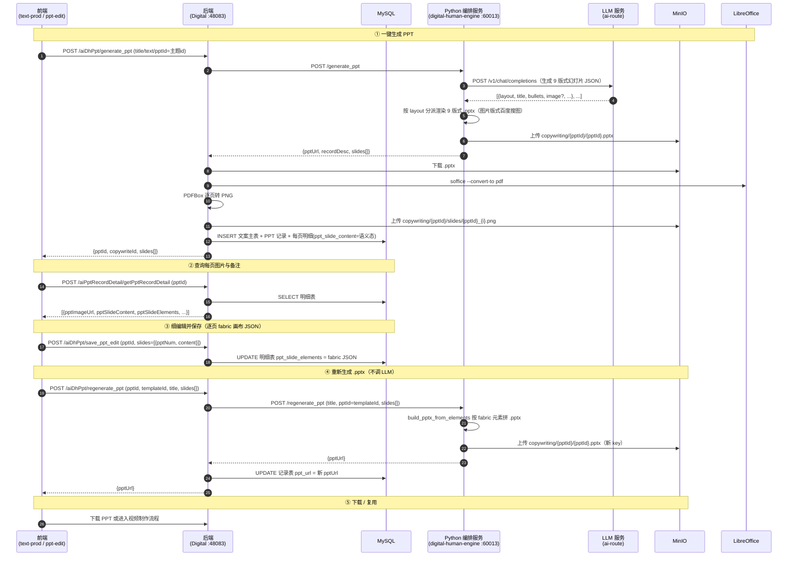

# PPT 制作完整时序

> 模块：`yudao-module-digital`
> 核心类：`AiDhPptController`、`AiDhPptServiceImpl`、`PptRecordDetailController`、`CopywritingManagementServiceImpl`
> 数据表：`tb_ai_dh_copywrite`（文案主表）、`tb_ai_dh_copywrite_ppt_record`（PPT 记录）、`tb_ai_dh_copywrite_ppt_record_detail`（PPT 每页明细）
> 对象存储：MinIO（`aidigital` bucket）

## 1. 概述

PPT 制作 = **AI 一键生成课件 PPT → 前端逐页细编辑 → 重新生成可下载的 `.pptx`**。整条链路分两个阶段：

1. **一键生成 PPT**：文案正文交给 LLM 整理成 **9 版式结构化 JSON**（封面/目录/章节过渡/标题要点/左图右文/全图/金句/对比/结束）→ Python 用 `python-pptx` 按 `layout` 分派渲染 9 版式生成 `.pptx` → 上传 MinIO → **Java 用 LibreOffice 从 `.pptx` 逐页渲染 PNG 预览**（soffice→PDF→PDFBox）→ 落「文案主表 + PPT 记录 + 每页明细」三张表。
2. **PPT 细编辑**：前端在 fabric 画布上逐页编辑元素 → 每页画布 JSON 存进明细表的**编辑态列 `ppt_slide_elements`**（语义态 `ppt_slide_content` 保持不变）→ 点「重新生成」按 fabric 元素 JSON 重建 `.pptx`。

职责分工：**幻灯片内容生成 + `.pptx` 渲染在 Python 编排服务（`digital-human-engine`）**；**每页 PNG 预览在 Java 侧用 LibreOffice 渲染**（保证与 `.pptx` 版式/字体一致）；Java 负责转发 + 落库 + 出图。

### 相对旧版的关键变化

- 幻灯片内容从「标题+要点」两种版式扩展为 **9 种版式**，由每页 `layout` 字段驱动。
- 图片版式（`image_text`/`full_image`/`quote`）由 **百度图片动态搜图** 配图，搜图失败降级（回退主题背景 / 占位 / 白底）。
- PNG 预览改由 **Java 侧 LibreOffice** 渲染（替代引擎 Pillow 逐页出图，避免 PNG 与 .pptx 脱节）。
- 细编辑用 **双列存储**：语义态 `ppt_slide_content` + 编辑态 `ppt_slide_elements`，互不覆盖。
- 主题配色从代码迁出到 `templates/themes.json`；`.pptx` 显式设置中文字体（微软雅黑）。

## 2. 参与者

| 角色 | 说明 |
|---|---|
| 前端 | 文案创作（`text-prod.vue`）+ PPT 细编辑（`ppt-edit.vue`，fabric 画布） |
| 后端 | `AiDhPptController` + `AiDhPptServiceImpl` + `PptRecordDetailController` + `CopywritingManagementServiceImpl` |
| MySQL | `tb_ai_dh_copywrite` / `tb_ai_dh_copywrite_ppt_record` / `tb_ai_dh_copywrite_ppt_record_detail` |
| MinIO | 生成的 `.pptx` 文件 + 每页幻灯片 PNG 预览图 |
| Python 编排服务（`digital-human-engine`，60013） | 调 LLM 生成 9 版式幻灯片，`python-pptx` 生成/重建 .pptx，百度图片搜图，上传 MinIO |
| LLM 服务（`ai-route.huihaohealth.com`） | OpenAI 兼容的 `/v1/chat/completions`，生成提纲/正文/幻灯片内容 |
| LibreOffice | Java 侧 `soffice` 将 .pptx 转 PDF，再经 PDFBox 转每页 PNG |

## 3. Mermaid 时序图

## 4. 各步骤详细说明

### ① 一键生成 PPT = generate_ppt

- 接口：`POST /digital-api/system/aiDhPpt/generate_ppt`（controller `AiDhPptController`，service `AiDhPptServiceImpl.generatePpt`）
- 入参：`title`（标题）、`text`/`content`（文案正文）、`pptId`/`templateId`（主题 id）、`doc_name`、`user`（操作工号）、可选 `smart_id`（智能体人设）
- Python：`app.py` 的 `generate_ppt` → `services/ppt.py`
  - `generate_slides()`：LLM 把正文整理成 **9 版式结构化 JSON**，每页含 `layout` 字段 + 版式专属字段（`title`/`bullets`/`items`/`image`/`left`/`right`/`text`/`source`/`subtitle`/`notes` 等），控制在 6~10 页；`_normalize_slides()` 做规则兜底（首项强制 `cover`、末项强制 `closing`、未知/缺省 `layout` 回退 `content`）。
  - `build_pptx()`：`python-pptx` 按 `layout` 分派渲染 9 版式生成 `.pptx`，上传 `copywriting/{pptId}/{pptId}.pptx`。
  - 图片版式（`image_text`/`full_image`/`quote`）：`services/image_search.py` 调百度图片（`image.baidu.com/search/acjson`）按 `image` 关键词搜图并下载，`full_image`/`quote` 加「壁纸」修饰；搜图失败回退主题背景/占位/白底。
  - 返回 `{pptUrl, recordDesc, slides[]}`（不再返回引擎渲染的 `images[]`）。
- 后端 `AiDhPptServiceImpl.generatePpt`：
  1. `copywritingCreate()` 落文案主表 → 返回 `copywriteId`；
  2. `copywritingCreatePPT()` 落 PPT 记录（`recordType=0` 系统生成，`recordVersion=1`，`recordFormat=pptx`，并回写文案主表 `mainPptId`）→ 返回 `pptId`；
  3. `renderPptToImages(pptUrl, pptId)`：从 MinIO 下载 .pptx → `PptToPdfUtil`（soffice→PDF）→ `PdfToImageUtil`（PDFBox→每页 PNG）→ 上传 MinIO，返回每页 PNG URL；
  4. 逐页 `commonMapper.insertPptRecordDetail()` 落明细（`ppt_slide_content` 存语义态 JSON，`ppt_slide_elements` 存空，`ppt_image_url` 存 LibreOffice 渲染的预览图）。
- 返回 `{pptId, copywriteId, slides[]}` 供前端预览/编辑。

> 说明：PPT 出图改为 **Java 侧 LibreOffice**（soffice→PDF→PDFBox），保证预览 PNG 与 .pptx 版式/字体一致；引擎的 Pillow 仅保留 `list_templates` 的主题缩略图渲染。`PptToPdfUtil` 的 `waitFor()` 加了 120s 超时，超时强制终止。

### ② 查询每页图片与备注 = getPptRecordDetail

- 接口：`POST /digital-api/system/aiPptRecordDetail/getPptRecordDetail`（controller `PptRecordDetailController`）
- 入参：`pptId`（PPT 记录 id）
- SQL：`CommonMapper.getPptRecordDetail`，`SELECT * FROM tb_ai_dh_copywrite_ppt_record_detail WHERE ppt_id = #{mainPptId} ORDER BY ppt_num`
- 返回每页 `ppt_image_url`（预览图）、`ppt_image_words`（备注/解说词）、`ppt_slide_content`（语义态）、`ppt_slide_elements`（编辑态 fabric 画布 JSON，可空）等。
- 前端 `ppt-edit.vue` 据此恢复每页画布：**优先用 `ppt_slide_elements` 的 fabric JSON**，未编辑才从 `ppt_slide_content` 解析 title/bullets。

### ③ 细编辑保存 = save_ppt_edit

- 接口：`POST /digital-api/system/aiDhPpt/save_ppt_edit`（controller `AiDhPptController`，service `AiDhPptServiceImpl.savePptEdit`）
- 入参：`pptId`（PPT 记录 id）、`slides=[{pptNum, content}]`，其中 `content` 是**该页 fabric 画布 JSON 字符串**（`JSON.stringify(canvas.toJSON(['id']))`，即 `{"objects":[...]}`）。
- 动作：逐页 `commonMapper.updatePptSlideElements()`，把 `content` 写入明细表的 **`ppt_slide_elements`** 字段（**不再覆盖 `ppt_slide_content` 语义态**）。
- 不调 Python，纯落库。

### ④ 重新生成 .pptx = regenerate_ppt

- 接口：`POST /digital-api/system/aiDhPpt/regenerate_ppt`（controller `AiDhPptController`，service `AiDhPptServiceImpl.regeneratePpt`）
- 入参：`pptId`（PPT 记录 id）、`templateId`（主题 id）、`title`、`slides[]`（每页 fabric 画布 JSON 字符串）
- Python：`app.py` 的 `regenerate_ppt` → `services/ppt.py:build_pptx_from_elements()`
  - 遍历 `slides`，每页解析 `{"objects":[...]}`，按元素类型重建 `.pptx`：
    - `rect` 且 `id == "ppt-bg"` → 整页背景色（`fill` hex）；
    - `textbox` → 文本框（`left/top/width/height/scaleX/scaleY/text/fontSize/fill/fontWeight`，`fontSize` 乘 0.75 换算成 pt）；
    - `image` → 图片（`src` 支持 `data:image` base64 或 URL，`urllib` 拉取）。
  - 上传新 key `copywriting/{pptId}/{pptId}.pptx`，返回 `{pptUrl}`。
- 后端 `regeneratePpt`：把 `templateId` 作为 `pptId` 字段传给 Python（`get_template` 用它选主题），成功后 `commonMapper.updatePptRecordUrl()` 更新记录表 `ppt_url` 为新地址。
- **不调 LLM**，纯按前端画布元素重建。

### ⑤ 上传 PPT 转图片 = pilgrimage / ppttoimage

- 接口：`POST /digital-api/system/aiDhPpt/pilgrimage`（controller `AiDhPptController`，service `AiDhPptServiceImpl.pilgrimage`）
- 入参：`ppt_path`（MinIO 上已有 .pptx 的 key）、`ppt_id`、`copywrite_id`、`user`
- 动作（Java 侧 `PptToPdfUtil` + `PdfToImageUtil`）：从 MinIO 下载 .pptx → LibreOffice 转 PDF → 逐页转 PNG → 上传 MinIO → 落明细表。
- 与 `generatePpt` 的 `renderPptToImages` 同源（同一套 soffice→PDF→PDFBox 渲染）；本接口主要用于「自己上传 PPT」的转图场景。

## 5. 数据表

| 表 | 作用 |
|---|---|
| `tb_ai_dh_copywrite` | 文案主表，`main_ppt_id` 指向当前 PPT 记录 |
| `tb_ai_dh_copywrite_ppt_record` | PPT 记录，`ppt_url`（.pptx 地址）、`record_type`（0 系统生成 / 1 自己上传）、`record_version`、`record_format` |
| `tb_ai_dh_copywrite_ppt_record_detail` | 每页明细，`ppt_id` + `ppt_num` 唯一页，`ppt_image_url`（预览图）、`ppt_image_words`（备注/解说词）、`ppt_slide_content`（语义态）、`ppt_slide_elements`（编辑态 fabric 画布 JSON） |

明细表关键字段（来自 `CommonMapper.xml`）：

| 字段 | 含义 |
|---|---|
| `ppt_id` / `ppt_num` | 关联 PPT 记录 + 页码（从 0 起） |
| `ppt_image_url` | 该页 PNG 预览图（LibreOffice 渲染） |
| `ppt_image_words` | 该页解说词/备注 |
| `ppt_slide_content` | **语义态**：LLM 生成的 9 版式 JSON（生成时写入，细编辑不覆盖） |
| `ppt_slide_elements` | **编辑态**：前端 fabric 画布 JSON（细编辑保存，可空） |
| `ppt_voice_url` / `ppt_voice_length` / `ppt_voice_human_url` / `ppt_video_image_url` | 视频制作流程回填的语音/口型/合成地址 |

> 迁移：`ppt_slide_elements` 列通过 `sql/mysql/2026-09-29_add_ppt_slide_elements.sql` 新增，**部署前需手动执行一次**。

## 6. 关键点

- **两阶段**：`generate_ppt` 走 LLM 生成 9 版式内容并出图；`save_ppt_edit` + `regenerate_ppt` 是**纯前端画布 → .pptx** 的编辑闭环，不碰 LLM。
- **语义态 vs 编辑态双存**：`ppt_slide_content` 存 LLM 生成的语义 JSON（生成时写入，始终保留）；`ppt_slide_elements` 存前端 fabric 编辑结果（可空）。细编辑读 elements 优先，未编辑回退 content。
- **fabric 画布 JSON 是编辑态**：每页元素以 `{"objects":[{type, left, top, width, height, scaleX, scaleY, ...}]}` 存 `ppt_slide_elements`；`regenerate_ppt` 直接读这个结构重建 .pptx。
- **坐标换算**：fabric 画布按 1280px 宽设计，`_PX2EMU = 9525`（1px = 9525 EMU），对应 .pptx 13.333 英寸宽；`fontSize` 乘 0.75 把 px 字号换算成 pt。
- **`pptId` 语义复用**：`regenerate_ppt` 里 Java 把 `templateId` 放进请求的 `pptId` 字段传给 Python（用来选主题 `get_template`），而真正的记录 id 只用于 Java 侧回写 `ppt_url`——两处 `pptId` 含义不同，注意区分。
- **图片三种来源**：① 生成期图片版式（`image_text`/`full_image`/`quote`）由 `image_search.py` 百度搜图；② `build_pptx_from_elements` 的图片元素 `src` 支持 `data:image` base64 或 http URL（`urllib` 拉取），URL 拉取失败时静默跳过；③ 主题背景图 `bg_0~3.jpg` 作兜底。
- **主题模板**：`services/templates/themes.json` 内置 4 套主题（`0` 课程学习汇报 / `1` 读书分享演示 / `2` 蓝色通用商务 / `3` 蓝色工作汇报总结），`_load_themes()` 加载（配色唯一事实源，旧 `colors.json` 已删除）；`get_template` 找不到时回退第一套。
- **中文字体**：`.pptx` 侧显式 `font.name = 微软雅黑`（latin + east asian 都设）；Pillow 侧 `_FONT_CANDIDATES` 跨平台候选（macOS/Linux/Windows）。
- **PPT 记录版本**：同一文案可多次生成/上传 PPT，`copywritingListPPT` 按 `record_version` 排序展示；系统生成 `record_version=1` 起。
- **删除连带**：删文案/PPT 时同步清理关联的 PPT 记录与每页明细（见 `CopywritingManagementServiceImpl.copywritingDelete` / `copywritingPPTDelete`）。

## 7. 故障排查 FAQ

### 7.1 生成 PPT 返回「未配置 LLM_API_KEY」

**现象**：`generate_ppt` 返回 `code=9999`，msg 提示未配置 key。

**原因**：`config.py` 读不到 `LLM_API_KEY`（`digital-human-engine/.env` 缺失或未放 key）。

**解决**：在 `digital-human-engine/.env` 写 `LLM_API_KEY=...`，重启编排服务。

### 7.2 生成 PPT 返回「Expecting value: line 1 column 1」

**现象**：`generate_ppt` 返回 `code=9999`，msg 为 `Expecting value: line 1 column 1 (char 0)`。

**原因**：`claude-opus-4-7-cc` 把思考放在 `reasoning_content`、答案放在 `content`；`content` 偶发为空时 `chat()` 返回空串，`_extract_json` 解析空串报错。

**解决**：`services/llm.py:chat()` 已兜底——`content` 为空时改用 `reasoning_content`（已修复）；`_extract_json` 对空值抛中文错误。

### 7.3 生成 PPT 返回「Expecting ',' delimiter」

**现象**：`generate_ppt` 返回 `code=9999`，msg 含 `Expecting ',' delimiter` 或「LLM 返回不是合法 JSON」。

**原因**：LLM 生成的幻灯片 JSON 被 `max_tokens` 截断。

**解决**：`services/llm.py:chat()` / `ppt.py:generate_slides()` 已调大 `max_tokens=16384` + `temperature=0.3`（已修复）。

### 7.4 重新生成 .pptx 后前端看不到新内容

**现象**：`regenerate_ppt` 返回成功，但下载的 .pptx 还是旧的。

**原因**：`regenerate_ppt` 只更新了 `ppt_record.ppt_url`，没重新渲染每页 PNG 预览图；前端列表/画布仍展示旧图。

**解决**：确认前端重新下载用的是新的 `ppt_url`；若需同步刷新预览图，需另行重出 `ppt_image_url`（当前实现未做）。

### 7.5 细编辑保存后刷新页面，画布元素丢失

**现象**：编辑完点保存，刷新后画布变回默认。

**原因**：`save_ppt_edit` 依赖前端传的 `pptNum` 与明细表 `ppt_num` 一一对应；若画布页与明细页错位，`ppt_slide_elements` 写错行。

**解决**：确认前端 `slides` 的 `pptNum` 从 0 起按顺序，且 `pptId` 传的是 PPT 记录 id（不是文案 id）。

### 7.6 重新生成 .pptx 报「PPT重新生成服务无响应」或 `code=9999`

**现象**：`regenerate_ppt` 返回失败，或 msg 为空。

**原因**：`build_pptx_from_elements` 解析 fabric JSON 异常（`objects` 缺失、`slides` 不是 JSON 字符串等），Python 抛错返回 `code=9999`；Java 侧 `getPpt == null` 时提示「无响应」。

**解决**：看 `/tmp/digital-human-engine.log` 的 `regenerate_ppt error` 堆栈；确认 `slides[]` 每项是合法的 fabric JSON 字符串或对象。

### 7.7 细编辑保存报错「Unknown column 'ppt_slide_elements'」

**现象**：`save_ppt_edit` 返回失败，后端日志报 `Unknown column 'ppt_slide_elements' in 'field list'`。

**原因**：`ppt_slide_elements` 列尚未在数据库创建（该表不在仓库 SQL 中，需手动迁移）。

**解决**：执行 `sql/mysql/2026-09-29_add_ppt_slide_elements.sql`（`ALTER TABLE ... ADD COLUMN ppt_slide_elements TEXT NULL`）后重启服务。

### 7.8 生成 PPT 时 Java 侧 LibreOffice 转 PDF 超时/失败

**现象**：`generate_ppt` 在渲染 PNG 阶段失败，日志含 `convertOffice2PDF 超时` 或 LibreOffice 报错。

**原因**：目标机未装 LibreOffice，或 soffice 路径不对（`PptToPdfUtil` 硬编码 `/Applications/LibreOffice.app/Contents/MacOS/soffice`，Windows 分支为 `cmd /c start soffice ...`）；`waitFor()` 已加 120s 超时并强制终止，避免历史挂起。

**解决**：确保部署机已装 LibreOffice 且路径匹配 `PptToPdfUtil` 中的 os 分支；超时可通过调整 `PptToPdfUtil.executeCommand` 的 `waitFor(120, TimeUnit.SECONDS)` 参数。
