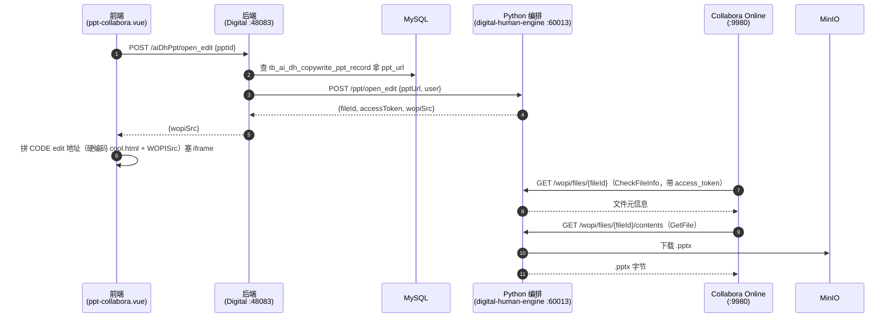
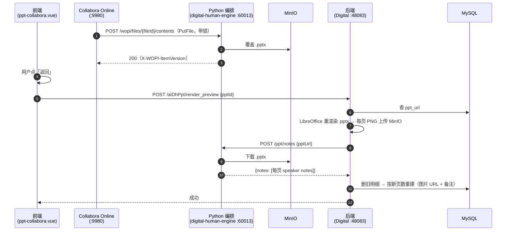

# PPT 在线编辑（Collabora）完整时序

> 模块：`yudao-module-digital`
> 核心类：`AiDhPptController`、`AiDhPptServiceImpl`、`CallPythonService`、`CommonMapper`
> 数据表：`tb_ai_dh_copywrite_ppt_record`（PPT 记录，`id`=pptId、`ppt_url`=MinIO key）、`tb_ai_dh_copywrite_ppt_record_detail`（每页明细：`ppt_image_url`、`ppt_image_words` 等）
> 对象存储：MinIO（`aidigital` bucket）
> 外部服务：Collabora Online（CODE，浏览器内的 LibreOffice 编辑器）

## 1. 概述

PPT 生成后（`generate_ppt` 或 `generate_ppt_master`），前端「编辑」不再进 fabric 画布编辑器，而是打开 **Collabora Online（CODE）** 在浏览器里直接编辑 `.pptx`。本服务通过 **WOPI 协议** 充当 WOPI host：把 CODE 的文件读写桥接到 MinIO。

整条链路跨 3 个项目：

1. **前端**（`digital-human-web`）：`ppt-collabora.vue` 全屏页内嵌 CODE iframe；制作页 / 文案列表 / ppt-master 三处「编辑」入口。
2. **Java**（本服务）：`open_edit` 代理（pptId → pptUrl → Python 签发 token）、`render_preview` 重渲染预览图 + 回写备注。
3. **Python**（`digital-human-engine`）：`/ppt/open_edit`、`/wopi/*`（WOPI host）、`/ppt/notes`（提取 speaker notes）。

## 2. 参与者

| 角色 | 说明 |
|---|---|
| 前端 | `ppt-collabora.vue`（全屏页）、`ppt-prod.vue` / `text-mgmt.vue` / `ppt-master.vue`（编辑入口） |
| 后端 | `AiDhPptController` + `AiDhPptServiceImpl` + `CallPythonService` + `CommonMapper` |
| MySQL | `tb_ai_dh_copywrite_ppt_record` / `tb_ai_dh_copywrite_ppt_record_detail` |
| MinIO | 生成/编辑的 `.pptx` + 每页预览 PNG |
| Python 编排服务（`digital-human-engine`，60013） | `/ppt/open_edit`、`/wopi/*`、`/ppt/notes`，`services/wopi.py`（token/锁/版本） |
| Collabora Online（CODE，9980） | 浏览器内编辑器，通过 WOPI 协议读写 WOPI host |
| LibreOffice | Java 侧 `soffice` → PDF → PDFBox 逐页 PNG（预览重渲染） |

## 3. Mermaid 时序图

### 3.1 打开编辑



### 3.2 编辑保存 + 重渲染预览



## 4. 接口清单

### 4.1 Java（本服务）

| 接口 | 方法 | 说明 |
|---|---|---|
| `/digital-api/system/aiDhPpt/open_edit` | POST | 入参 `{pptId, user?}`；pptId → 查 `ppt_url` → 调 Python `/ppt/open_edit` → 返回 `{wopiSrc, accessToken, fileId}` |
| `/digital-api/system/aiDhPpt/render_preview` | POST | 入参 `{pptId}`；重渲染预览图 + 从 .pptx 提取 speaker notes → 删后重建每页明细 |

### 4.2 Python（`digital-human-engine`）

| 接口 | 方法 | 说明 |
|---|---|---|
| `/ppt/open_edit` | POST | 入参 `{pptUrl, user?}`；签发 WOPI access_token，返回 `{wopiSrc, accessToken, fileId}` |
| `/wopi/files/{fileId}` | GET | CheckFileInfo（文件元信息） |
| `/wopi/files/{fileId}` | POST | 锁操作（`X-WOPI-Override`: LOCK/UNLOCK/REFRESH_LOCK/GET_LOCK） |
| `/wopi/files/{fileId}/contents` | GET | GetFile（下发 .pptx） |
| `/wopi/files/{fileId}/contents` | POST | PutFile（保存编辑后的 .pptx 回 MinIO） |
| `/ppt/notes` | POST | 入参 `{pptUrl}`；返回 `data.notes`（每页 speaker notes 列表） |

## 5. 关键实现说明

- **WOPI access_token**：`services/wopi.py` 用 `WOPI_SECRET` HMAC 签名（`fileId|user|exp|sig`），短时过期、绑定 fileId；所有 WOPI 请求都带 `access_token`，Java/Python 校验签名 + fileId 匹配。
- **锁与版本**：内存态（单进程），`services/wopi.py` 维护 LOCK/UNLOCK/REFRESH_LOCK + 版本号；多人协作编辑依赖锁。
- **重渲染预览**：`renderPreview` 调 `renderPptToImages`（soffice → PDF → PDFBox → PNG）重渲染图片，再调 Python `/ppt/notes` 提取 speaker notes，最后 `deletePptRecordDetail` 删旧行 + `insertPptRecordDetail` 按新页数重建——**页数变化（增删页）也能自适应，备注按当前页序精确对应**。
- **前端编辑地址硬编码**：CODE 未开 CORS，浏览器不能跨域 fetch `/hosting/discovery`，所以 `ppt-collabora.vue` 直接硬编码 `http://localhost:9980/browser/<hash>/cool.html`（hash 为 CODE 构建号）。

## 6. 部署（CODE）

```bash
docker run -t -d -p 9980:9980 \
  -e 'aliasgroup1=http://192.168.1.4:60013' \
  -e 'username=admin' -e 'password=xxx' \
  -e 'extra_params=--o:ssl.enable=false' \
  --restart always --cap-add MKNOD \
  --name collabora-code collabora/code
```

配置要点（详见 `digital-human-engine` 的 `README.md`）：

- `aliasgroup1` 填 WOPI host 的**字面量 `http://host:port`**（不能用 `:.*` 正则端口，会被 parseAliases 丢弃）。
- 只关 `ssl.enable`，**不要加 `ssl.termination=true`**（否则 discovery 广告 https、容器只跑 http）。
- `WOPI_HOST`（Python 侧）填 CODE 容器能访问到本系统的地址（宿主局域网 IP），且与 `aliasgroup1` 一致。
