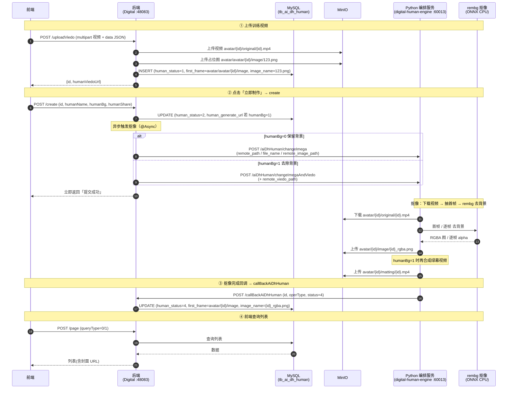
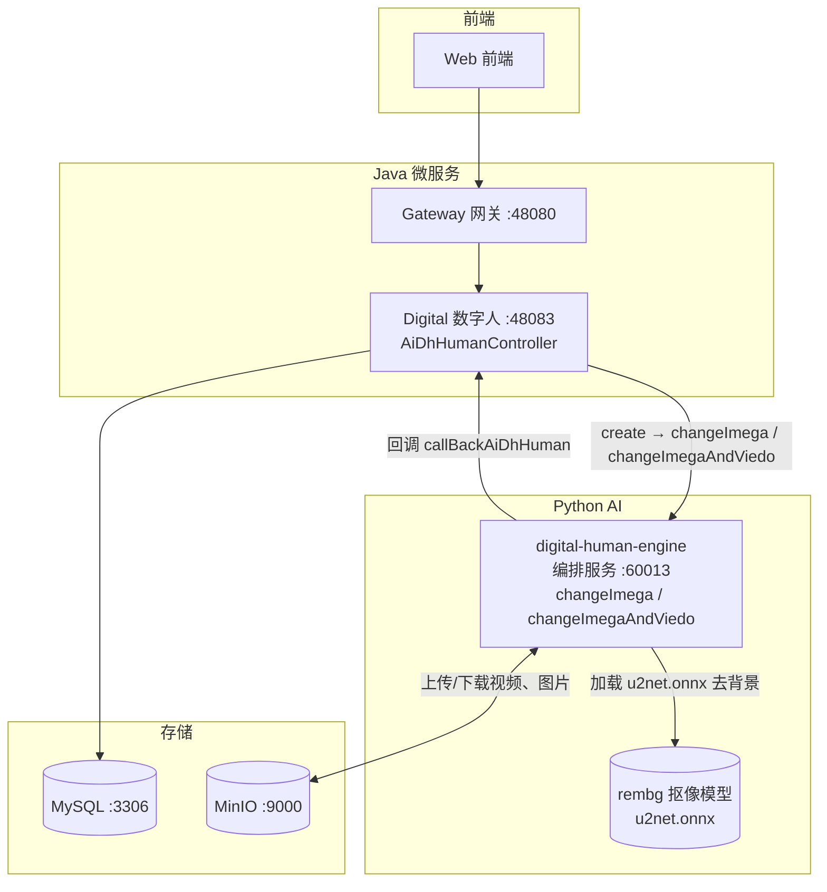

# 形象复刻（Avatar Clone）完整时序

> 模块：`yudao-module-digital`
> 核心类：`AiDhHumanController`、`AiDhHumanServiceImpl`、`AiDhHumanAdaptor`
> 数据表：`tb_ai_dh_human`
> 对象存储：MinIO（`aidigital` bucket）

## 1. 概述

形象复刻 = **数字人形象定制**：用户上传一段「训练视频」，系统把**人物从背景里抠出来**，产出带透明通道的 RGBA 图片（选择「去除背景」时再额外产出一段抠像视频），作为后续数字人合成/驱动的「形象底子」。

抠像（背景去除）用 **rembg**（ONNX，CPU 可跑，默认 `u2net` 模型）；口型合成（MuseTalk）是另一条链路，需 GPU，见 §7。

整条链路是**回调驱动的异步流程**：后端不轮询，`create` 触发后由 Python 服务抠像、上传 MinIO、再回调 Java 推进状态。

> 背景替换语义：`human_bg = 0` 保留拍摄背景（仅出抠图 PNG）；`human_bg = 1` 去除背景（出抠图 PNG + 抠像视频）。

## 2. 参与者

| 角色 | 说明 |
|---|---|
| 前端 | 形象复刻页面（`CreateDigitalAvatar.vue`）+ 形象管理列表（`DigitalPersonManage.vue`） |
| 后端 | `AiDhHumanController` + `AiDhHumanServiceImpl` + `AiDhHumanAdaptor` |
| MySQL | `tb_ai_dh_human` 表 |
| MinIO | 训练视频 / 占位图 / 抠图结果对象存储 |
| Python 编排服务（`digital-human-engine`，60013） | `changeImega`（抠图）、`changeImegaAndViedo`（抠图+抠像视频），用 rembg 去背景、上传 MinIO、回调 Java |
| rembg 抠像模型（ONNX Runtime，CPU） | 真正的背景去除引擎（u2net / isnet / birefnet） |
| MuseTalk 口型合成（GPU，未部署） | 数字人驱动（lip-sync），属 `/ai/changeVideo` 链路，见 §7.2 |

## 3. Mermaid 时序图



## 4. 各步骤详细说明

### ① 上传训练视频

- 接口：`POST /digital-api/system/aiDhHuman/uploadViedo`（controller `:77`，service `:129`）
- 动作：
  1. 生成 `id`（`SequenceUtils.getSeq()`）。
  2. 视频上传 MinIO：对象键 `avatar/{id}/original/{id}.mp4`（`uploadVideo`，service `:176`）。
  3. 占位图上传 MinIO：对象键 `avatar/avatar/{id}/image/123.png`（`uploadDefaultImage`，service `:186`；占位图源文件 `resources/placeholder/123.png`，处理中记录的封面显示用）。
  4. `INSERT tb_ai_dh_human`，`human_status=1`（未执行）、`first_frame=avatar/avatar/{id}/image`、`image_name=123.png`、`human_org_url=avatar/{id}/original`。
- 返回 `id` + `humanViedoUrl`。

### ② 「立即制作」= create

- 接口：`POST /digital-api/system/aiDhHuman/create`（controller `:65`，service `:74`）
- 动作：
  1. `UPDATE tb_ai_dh_human`：`human_status=2`（执行中）、`human_name`、`human_share`、`human_bg`；`humanBg=1` 时写 `human_generate_url=avatar/{id}/matting`。
  2. 异步（`@Async("callPythonInterFaceExecutor")`）调 Python：
     - `humanBg=0` → `POST /aiDhHuman/changeImega`（仅抠图）
     - `humanBg=1` → `POST /aiDhHuman/changeImegaAndViedo`（抠图 + 抠像视频）
- 接口**立即返回**，不等待抠像结果。
- 传给 Python 的关键参数（均为 MinIO 对象键）：

| 参数 | 含义 |
|---|---|
| `id` | 形象 id |
| `remote_path` | 视频目录键 `avatar/{id}/original` |
| `file_name` | 视频文件名 `{id}.mp4` |
| `remote_image_path` | 抠图输出目录键 `avatar/{id}/image` |
| `remote_viedo_path` | 抠像视频输出目录键 `avatar/{id}/matting`（仅 bg1） |
| `host`/`port`/`username`/`password` | 历史遗留 SFTP 凭据，Python 侧已不再使用（MinIO 迁移） |

### ③ Python 抠像

- 入口：`app.py` 的 `change_imega`（`:158`）、`change_imega_and_viedo`（`:182`）
- 实现：`services/video.py` 的 `matting_image`（`:133`）、`matting_video`（`:148`）
- 动作：
  - `matting_image`：ffmpeg 抽首帧 → `rembg.remove()` 去背景 → 上传 RGBA PNG 到 `avatar/{id}/image/{id}_rgba.png`。
  - `matting_video`（仅 bg1）：`cv2` 逐帧读取 → 逐帧 `rembg.remove()` → 合成纯绿幕背景（`(0,255,0)`）→ `mp4v` 编码 → 上传 `avatar/{id}/matting/{id}.mp4`。MP4 不支持 alpha，故用绿幕承载透明区，下游可 chroma-key 还原。

### ④ 抠像完成回调 → 落库

- 接口：`POST /digital-api/system/aiDhHuman/callBackAiDhHuman`（controller `:175`，service `:742`，**在 `permit_all_urls` 白名单中**）
- 回调体：`CallBackVo { id, operType, status }`
  - `operType`：`1` 视频+抠图 / `2` 仅图片。
  - `status`：`3` 失败 / `4` 成功。
- 动作：`status=4` 时写回 `image_name={id}_rgba.png`、`first_frame=avatar/{id}/image`；`human_status` 更新为回调的 `status`。

### ⑤ 列表查询

- 接口：`POST /digital-api/system/aiDhHuman/page`（controller `:90`，service `:206`）
- 动作：`queryType=0` 按 `opr_staff`（当前用户）过滤；`queryType=1` 按 `human_share=1`（公共库）过滤。封面 URL 拼装：

```java
imageUrl + "/" + MinioClientService.toObjectKey(first_frame) + "/" + image_name
// 例：http://localhost:9000/aidigital/avatar/{id}/image/{id}_rgba.png
```

## 5. 状态机

| human_status | 含义 |
|---|---|
| `1` | 已上传，未制作（`uploadViedo` 落库初值） |
| `2` | 执行中（`create` 落库，等待抠像回调） |
| `3` | 执行失败（回调 status=3） |
| `4` | 执行成功（回调 status=4，最终可用） |

## 6. 关键点

- **全程异步**：`create` 内通过 `@Async` 触发 Python 抠像，接口立即返回；结果靠 Python 回调 `callBackAiDhHuman` 推进，**不是轮询**。
- **humanBg 用途区分**：
  - `0` 保留背景 → 仅 `changeImega`，产出 `{id}_rgba.png`；
  - `1` 去除背景 → `changeImegaAndViedo`，产出 `{id}_rgba.png` + `avatar/{id}/matting/{id}.mp4`。
- **占位图**：上传阶段写入 `first_frame=avatar/avatar/{id}/image` + `image_name=123.png`，处理中记录封面能显示；回调成功后覆盖为真实抠图结果。
- **回调白名单**：`callBackAiDhHuman` 在 `application-local.yaml` 的 `permit_all_urls` 中，允许 Python 匿名调用。
- **MinIO 对象键结构**：
  - 视频原片：`avatar/{id}/original/{id}.mp4`
  - 占位图：`avatar/avatar/{id}/image/123.png`
  - 抠图结果：`avatar/{id}/image/{id}_rgba.png`
  - 抠像视频：`avatar/{id}/matting/{id}.mp4`
- **抠像模型可配**：`digital-human-engine/config.py` 的 `MATTING_MODEL`（默认 `u2net`，可切 `isnet-general-use`/`birefnet-general`）。

## 7. 抠像 / 数字人部署

### 7.1 抠像（rembg，本地 CPU）

抠像由**一个 Python 编排服务**承载（与声音复刻共用 `digital-human-engine`），rembg 作为 Python 库进程内调用，无需独立服务。



### 7.2 口型合成（Wav2Lip，CPU 可跑；可选 MuseTalk）

「让形象跟着音频说话」是另一条链路 `/ai/changeVideo`（语音合成数字人视频）。口型合成模型**默认用 Wav2Lip**（判别式，CPU 可跑），也可切 **MuseTalk**（扩散模型，需 GPU），由 `config.py` 的 `LIPSYNC_MODEL` 控制（`wav2lip` / `musetalk`）。

#### 7.2.1 调度架构

```
/ai/changeVideo（app.py）
  └─ _lipsync_change_video()  按 LIPSYNC_MODEL 调度
       ├─ wav2lip.change_video()   默认：subprocess 调 Wav2Lip 仓库 inference.py
       └─ musetalk.change_video()  可选：HTTP 调 MuseTalk GPU 服务
```

- `services/wav2lip.py`：从 MinIO 下载视频+音频 → 落本地临时文件 → subprocess 调 `<WAV2LIP_HOME>/.venv/bin/python inference.py`（`--checkpoint_path WAV2LIP_CHECKPOINT`）→ 结果上传 MinIO。
- `services/musetalk.py`：HTTP 调 `MUSETALK_API`（GPU），保留兼容。

#### 7.2.2 Wav2Lip 部署（本地 CPU / Apple Silicon）

```bash
cd ~/IdeaProjects/ai-digital
git clone --recurse-submodules https://github.com/Rudrabha/Wav2Lip.git
cd Wav2Lip
python3 -m venv .venv
./.venv/bin/pip install torch opencv-python librosa numba tqdm numpy scipy
```

权重：

| 文件 | 放置路径 | 大小 | 来源 |
|---|---|---|---|
| `wav2lip_gan.pth` | `checkpoints/` | ~435M | README 的 Google Drive 文件夹 `1I-0dNLfFOSFwrfqjNa-SXuwaURHE5K4k`（经典权重；**不是** `Wav2Lip-SD-*.pt` 那套 TorchScript） |
| `s3fd.pth` | `face_detection/detection/sfd/` | ~85M | `https://www.adrianbulat.com/downloads/python-fan/s3fd-619a316812.pth` |

兼容修复：`audio.py` 的 `_build_mel_basis()` 里 `librosa.filters.mel` 老签名改为关键字（`sr=`/`n_fft=`），否则新版 librosa 报错。

#### 7.2.3 配置（`digital-human-engine/config.py`）

| 变量 | 默认 | 说明 |
|---|---|---|
| `LIPSYNC_MODEL` | `wav2lip` | `wav2lip`(CPU) / `musetalk`(GPU) |
| `WAV2LIP_HOME` | 空 | Wav2Lip 仓库根目录（启动服务时需设置） |
| `WAV2LIP_PYTHON` | 空 | Wav2Lip venv 的 python，留空用 `<WAV2LIP_HOME>/.venv/bin/python` |
| `WAV2LIP_CHECKPOINT` | `checkpoints/wav2lip_gan.pth` | checkpoint 路径 |
| `WAV2LIP_FACE_DET` | `face_detection/detection/sfd/s3fd.pth` | 人脸检测权重 |
| `WAV2LIP_BATCH_SIZE` | `16` | CPU 用小 batch |

启动：`WAV2LIP_HOME=/path/to/Wav2Lip ./venv/bin/uvicorn app:app ...`

#### 7.2.4 性能

CPU（Apple Silicon）实测：1.2s 音频约 70s（人脸检测 + 唇形合成，~35s/批次）。短片段可接受，长视频建议 GPU（MuseTalk 或 Wav2Lip GPU 版）。


### 7.3 抠像安装（Apple Silicon / CPU）

```bash
cd ~/IdeaProjects/ai-digital/digital-human-engine
./.venv/bin/pip install rembg          # 依赖 onnxruntime（venv 已装）
```

首次运行会自动下载默认模型 `u2net.onnx`（~176M）到 `~/.u2net/`。

### 7.4 抠像模型选择

| MATTING_MODEL | 说明 |
|---|---|
| `u2net`（默认） | 快，通用背景去除，发丝边缘一般 |
| `isnet-general-use` | 精度更好，速度居中 |
| `birefnet-general` | BiRefNet，抠像质量最好（发丝/边缘），CPU 较慢 |

通过环境变量切换：`export MATTING_MODEL=birefnet-general`。

### 7.5 性能

- **抠图（单帧）**：CPU（Apple Silicon）约 **0.9s**/帧。
- **抠像视频（逐帧）**：CPU 约 **0.4s**/帧，62s/1557 帧的视频约 10~13 分钟；生产建议 GPU。

## 8. 故障排查 FAQ

### 8.1 列表查不到形象

**现象**：`/page` 的「我的数字人」（`queryType=0`）查不到刚做的形象。

**原因**：`AiDhHumanAdaptor.queryCovDoForAll` 曾错误地按 `human_share = queryType` 过滤，导致 `human_share=1`（已分享）的形象不出现在「我的数字人」里，只出现在「公共库」。

**解决**：去掉 `human_share` 过滤，仅按 `opr_staff` 过滤（已修复）。

### 8.2 抠图结果发丝边缘发虚 / 有杂边

**现象**：`{id}_rgba.png` 人物边缘（尤其头发）抠不干净。

**原因**：默认 `u2net` 是通用模型，对精细边缘不敏感。

**解决**：切 `MATTING_MODEL=birefnet-general`（更慢但边缘更好），见 §7.4。

### 8.3 抠像视频生成很慢

**现象**：`humanBg=1` 时视频很久才完成。

**原因**：抠像视频是 CPU 逐帧 rembg，帧数越多越慢（~0.4s/帧）。

**解决**：生产用 GPU；本地联调可先测单帧抠图（`humanBg=0`）。

### 8.4 处理中记录封面 404

**现象**：`uploadViedo` 后、抠像完成前，封面 URL `.../aidigital/avatar/avatar/{id}/image/123.png` 打不开。

**原因**：占位图 `123.png` 缺失（或 `first_frame` 缺 `{id}` 前缀）。

**解决**：`uploadDefaultImage` 会在上传视频时自动把 `resources/placeholder/123.png` 上传到 MinIO（已修复）；`first_frame` 已带 `{id}`（已修复）。

### 8.5 回调后封面 URL 拼错

**现象**：完成态的封面 URL 出现 `.../aidigitalavatar/{id}/image/...`（缺 `/`）或 `.../aidigital/home/...`（残留 SFTP 路径）。

**原因**：`getAiDhHumanPage` 拼 URL 时 `imageUrl + first_frame` 缺分隔符，且未对 `first_frame` 做 SFTP→MinIO 键归一化。

**解决**：改为 `imageUrl + "/" + toObjectKey(first_frame) + "/" + image_name`（已修复）。

### 8.6 调 /ai/changeVideo 报「未配置 Wav2Lip 仓库路径」

**现象**：`POST /ai/changeVideo` 返回 `code=9999`，msg 提示 `未配置 Wav2Lip 仓库路径（WAV2LIP_HOME）`。

**原因**：默认 `LIPSYNC_MODEL=wav2lip`，但没设置 `WAV2LIP_HOME`。

**解决**：设置 `WAV2LIP_HOME` 并重启服务（见 §7.2）；若要用 MuseTalk，设 `LIPSYNC_MODEL=musetalk` + `MUSETALK_API`。

### 8.7 前端显示「执行中」但不更新

**现象**：点「立即制作」后，卡片一直显示「执行中」，即使后台已完成（`human_status=4`）。

**原因**：前端 `CardContainer.vue` 原本只在 `onMounted` 加载一次列表，没有轮询。

**解决**：`CardContainer.vue` 增加轮询——列表中存在 `1/2`（执行中）状态的形象时，每 5 秒刷新一次；全部完成后自动停止。同时 `DigitalPersonVO` 接口补上 `humanStatus` 字段。

