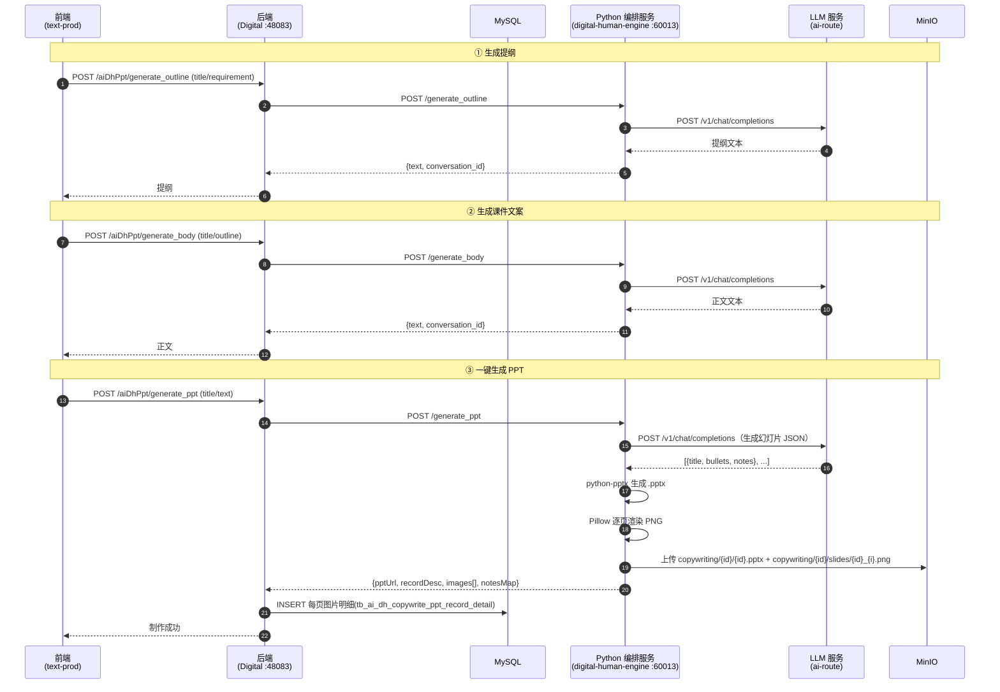

# 文案创作（Copywriting）完整时序

> 模块：`yudao-module-digital`
> 核心类：`AiDhPptController`、`AiDhPptServiceImpl`、`CopywritingManagementServiceImpl`
> 数据表：`tb_ai_dh_copywrite`（文案主表）、`tb_ai_dh_copywrite_ppt_record`（PPT 记录）、`tb_ai_dh_copywrite_ppt_record_detail`（PPT 每页图片明细）
> 对象存储：MinIO（`aidigital` bucket）

## 1. 概述

文案创作基于 **LLM 大模型**（OpenAI 兼容的 `ai-route` 网关，默认 `claude-opus-4-7-cc`）做三步 AI 生成，可选「智能体人设」控制风格：

1. **生成提纲**：根据「标题 + 主题描述」生成课件提纲。
2. **生成课件文案**：根据「标题 + 提纲」生成完整正文。
3. **一键生成 PPT**：把正文整理成幻灯片 → `python-pptx` 生成 `.pptx` + `Pillow` 逐页渲染 PNG → 上传 MinIO → 后端落文案主表 + PPT 记录 + 图片明细。

文案/PPT 的生成逻辑在 **Python 编排服务（`digital-human-engine`）** 里，Java 只负责转发请求 + 落库。整条链路**同步返回**（前端等 LLM 出结果），不走回调。

## 2. 参与者

| 角色 | 说明 |
|---|---|
| 前端 | 文案管理（`text-mgmt.vue`）+ 文案创作（`text-prod.vue`） |
| 后端 | `AiDhPptController` + `AiDhPptServiceImpl` + `CopywritingManagementServiceImpl` |
| MySQL | `tb_ai_dh_copywrite` / `tb_ai_dh_copywrite_ppt_record` / `tb_ai_dh_copywrite_ppt_record_detail` |
| MinIO | 生成的 `.pptx` 文件 + 每页幻灯片 PNG 图片 |
| Python 编排服务（`digital-human-engine`，60013） | 调 LLM 生成文案/幻灯片，python-pptx 生成 .pptx，Pillow 渲染图片，上传 MinIO |
| LLM 服务（`ai-route.huihaohealth.com`） | OpenAI 兼容的 `/v1/chat/completions`，实际的大模型推理 |

## 3. Mermaid 时序图

## 4. 各步骤详细说明

### ① 生成提纲

- 接口：`POST /digital-api/system/aiDhPpt/generate_outline`（controller `:200`，service `:152`）
- Python：`app.py` 的 `generate_outline`（`:326`）→ `services/llm.py:chat()`（`:7`）
- 动作：把「标题 + 主题描述」拼成 prompt 调 LLM，返回提纲文本；剥掉 Qwen 推理模型的 `<think>...</think>` 思考块只留正文。

### ② 生成课件文案

- 接口：`POST /digital-api/system/aiDhPpt/generate_body`（controller `:93`，service `:73`）
- Python：`app.py` 的 `generate_body`（`:346`）
- 动作：把「标题 + 提纲」拼成 prompt 调 LLM，返回完整正文。

### ③ 一键生成 PPT

- 接口：`POST /digital-api/system/aiDhPpt/generate_ppt`（controller `:134`，service `:91`）
- Python：`app.py` 的 `generate_ppt`（`:366`）
- 动作：
  1. `services/ppt.py:generate_slides()`（`:43`）：LLM 把正文整理成幻灯片 JSON（`{title, bullets, notes}`）。
  2. `services/ppt.py:build_pptx()`（`:56`）：`python-pptx` 生成 `.pptx`，上传 MinIO（`copywriting/{id}/{id}.pptx`）。
  3. `services/ppt.py:render_slide()`（`:75`）：`Pillow` 把每页渲染成 PNG（白底 + 标题 + 要点），上传 MinIO（`copywriting/{id}/slides/{id}_{i}.png`）。
  4. 返回 `{pptUrl, recordDesc, images[], notesMap}`。
- 后端 `AiDhPptServiceImpl.generatePpt`：先 `copywritingCreate` 落文案主表 → 再 `copywritingCreatePPT` 落 PPT 记录（`recordType=0` 系统生成，并回写文案主表 `mainPptId`）→ 遍历 `images[]` 落明细表（`pptId` 用 PPT 记录 id）。

> 说明：PPT 转图片原先是 Java 侧用 LibreOffice 做 PPT→PDF→图片，因依赖 LibreOffice 已改成 **Python 侧 Pillow 直接出图**，Java 不再碰 LibreOffice。

## 5. 关键点

- **同步流程**：`generate_outline`/`generate_body`/`generate_ppt` 都是同步返回（等 LLM 出结果），与「声音复刻/形象复刻」的回调式异步流程不同。
- **智能体人设**：前端选的 `smart_id` → 后端 `attachAgentRole` 按 id 查出 `tb_ai_dh_copywrite_agent.agent_role`，塞进请求的 `agentRole`，Python 作为 system prompt 前置到 messages，控制生成风格。
- **一键生成PPT 落三张表**：`tb_ai_dh_copywrite`（文案主表）→ `tb_ai_dh_copywrite_ppt_record`（PPT 记录，`recordType=0` 系统生成）→ `tb_ai_dh_copywrite_ppt_record_detail`（每页图片明细，`pptId` 关联 PPT 记录 id）。
- **LLM 响应清洗**：Qwen 推理模型会在开头返回 `<think>...</think>` 思考块，`services/llm.py:chat()` 里剥掉只留正文。
- **PPT 出图**：`python-pptx` 负责生成可下载的 `.pptx`，`Pillow` 负责渲染每页 PNG（供前端缩略图展示），两者都用 Python 侧的系统 CJK 字体（`Hiragino Sans GB` 等）渲染中文。
- **图片 URL 格式**：Python 返回的 `images[]` 是完整 URL（`{minioEndpoint}/{bucket}/{key}`），与 Java `minioUpload` 返回格式一致，后端直接落表。

## 6. LLM 服务配置（`digital-human-engine/config.py`）

| 变量 | 默认值 | 说明 |
|---|---|---|
| `LLM_API_BASE` | `https://ai-route.huihaohealth.com` | OpenAI 兼容网关地址 |
| `LLM_API_KEY` | 空 | API key，从 `.env` 文件加载（**勿提交 git**） |
| `LLM_MODEL` | `claude-opus-4-7-cc` | 默认模型（可选 `gpt-5.6-sol`、`Qwen3-14B`、`Qwen3.5-27B-JX` 等） |

- 密钥放 `digital-human-engine/.env`（已加 `.gitignore`），由 `config.py` 里的 `load_dotenv()` 加载。
- 可用模型：调 `GET {LLM_API_BASE}/v1/models` 查询（`Authorization: Bearer {key}`）。
- 调用方式：`POST {LLM_API_BASE}/v1/chat/completions`，OpenAI 标准格式。

## 7. 故障排查 FAQ

### 7.1 生成提纲/文案返回「未配置 LLM_API_KEY」

**现象**：`generate_outline` / `generate_body` 返回 `code=9999`，msg 提示未配置 key。

**原因**：`config.py` 读不到 `LLM_API_KEY`（`.env` 缺失或未放 key）。

**解决**：在 `digital-human-engine/.env` 里写 `LLM_API_KEY=...`，重启服务。

### 7.2 生成结果开头一堆 `<think>...</think>`

**现象**：文案开头出现 `<think>...` 思考过程。

**原因**：Qwen 推理模型的 CoT（思维链）输出。

**解决**：`services/llm.py:chat()` 已自动剥掉 `</think>` 之前的思考块（已修复）；若仍有残留，检查模型是否换了非推理模型。

### 7.3 一键生成PPT 卡住/超时

**现象**：`generate_ppt` 长时间无响应。

**原因**：历史上是 Java 侧 `PptToPdfUtil` 依赖 LibreOffice 转 PDF，本机没装 LibreOffice 导致 `process.waitFor()` 挂起。

**解决**：已改为 Python 侧 Pillow 直接出图，不再依赖 LibreOffice（已修复）。若仍慢，是 LLM 生成幻灯片耗时（正常几秒~十几秒）。

### 7.4 生成PPT 返回「生成图片异常」

**现象**：`generate_ppt` 返回 `code=9999`，msg「ppt生成图片异常」。

**原因**：Python 侧渲染/上传图片异常（字体缺失、MinIO 不可达等）。

**解决**：看 `/tmp/digital-human-engine.log` 里的 `generate_ppt error` 堆栈。

### 7.5 生成PPT 返回「Expecting value: line 1 column 1」

**现象**：`generate_ppt` 返回 `code=9999`，msg 为 `Expecting value: line 1 column 1 (char 0)`。

**原因**：`claude-opus-4-7-cc` 会把「思考」放在 `reasoning_content` 字段、答案放在 `content` 字段；当 `content` 偶发为空（尤其长正文）时，`chat()` 返回空串，`_extract_json` 解析空串报错。

**解决**：`services/llm.py:chat()` 已兜底——`content` 为空时改用 `reasoning_content`（已修复）；`_extract_json` 对空值抛中文错误。

### 7.6 生成PPT 返回「Expecting ',' delimiter」

**现象**：`generate_ppt` 返回 `code=9999`，msg 含 `Expecting ',' delimiter` 或「LLM 返回不是合法 JSON」。

**原因**：LLM 生成的幻灯片 JSON 被 `max_tokens` 截断（推理模型的思考内容 + 答案超预算）。

**解决**：`services/llm.py:chat()` / `services/ppt.py:generate_slides()` 已调大 `max_tokens=16384` + `temperature=0.3`（已修复），JSON 输出更完整稳定。

### 7.7 生成提纲/文案报「Unknown column 'tenant_id'」

**现象**：`generate_outline` 返回 `code=999`，Java 日志报 `SQLSyntaxErrorException: Unknown column 'tenant_id' in 'field list'`。

**原因**：`AiAgentDO` 继承了 `TenantBaseDO`（带 `tenant_id`/`create_time` 等字段），但 `tb_ai_dh_copywrite_agent` 表没有这些列；用 `aiAgentMapper.selectById()` 会拼出这些列报错。

**解决**：`AiDhPptServiceImpl.attachAgentRole()` 改用 `selectListAll()`（自定义 SQL `select *`，不会拼 tenant 列）后按 id 过滤（已修复）。

