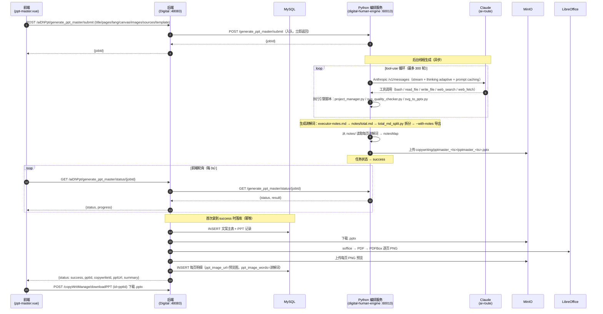

# ppt-master 完整时序

> 模块：`yudao-module-digital`
> 核心类：`AiDhPptController`、`AiDhPptServiceImpl`、`CallPythonService`
> 数据表：`tb_ai_dh_copywrite`（文案主表）、`tb_ai_dh_copywrite_ppt_record`（PPT 记录）、`tb_ai_dh_copywrite_ppt_record_detail`（每页明细）
> 菜单：`system_menu`（id=2837，parent=2763 数字人平台）
> 对象存储：MinIO（`aidigital` bucket）

## 1. 概述

ppt-master 是区别于「9 版式 python-pptx 一键生成」（`generate_ppt`，见 [`PPT制作完整时序.md`](./PPT制作完整时序.md)）的另一条**高质量 PPT 路线**：**LLM 当大脑 + 引擎脚本当手脚**，把主题/素材/模板交给 Claude 的 tool-use 循环，逐页手写 SVG，再由 `svg_to_pptx` 导出成**原生可编辑 .pptx**（含真实母版/版式 `p:sldMaster`/`p:sldLayout`）。

整条链路**推荐异步**（无提纲/正文分步）：**前端 `ppt-master.vue` 提交 → Java 转发 Python 入队 → Claude tool-use 生成 .pptx 上传 MinIO → 前端轮询状态 → 完成后 Java 落库 + LibreOffice 出预览图**。同步接口 `generate_ppt_master` 保留（内部仍阻塞），但前端已切到异步 submit + status。

> 设计细节（引擎侧软沙箱、接口契约、成本、安全）见 `digital-human-engine` 仓库（本仓库外兄弟项目）的 `docs/api-service-design.md`。

## 2. 参与者

| 角色 | 说明 |
|---|---|
| 前端 | `ppt-master.vue`（菜单「ppt-master」，`src/views/digital/ppt-master.vue`） |
| 后端 | `AiDhPptController` + `AiDhPptServiceImpl` + `CallPythonService` |
| MySQL | 文案主表 / PPT 记录 / 每页明细（复用文案创作三张表） |
| MinIO | 生成的 `.pptx` + 每页幻灯片 PNG 预览图 |
| Python 编排服务（`digital-human-engine`，60013） | `app.py:/generate_ppt_master` → `services/ppt_master.py`（Claude tool-use 循环）+ `skills/ppt-master/`（引擎脚本） |
| LLM 服务（`ai-route.huihaohealth.com`） | Anthropic `/v1/messages`（`claude-opus-4-7-cc`），`thinking: adaptive` + `output effort: high` |
| LibreOffice | Java 侧 `soffice` → PDF → PDFBox 逐页 PNG |

## 3. Mermaid 时序图

## 4. 各步骤详细说明

### ① 异步提交 = submit_ppt_master

- 接口：`POST /digital-api/system/aiDhPpt/generate_ppt_master/submit`（controller `AiDhPptController`，service `AiDhPptServiceImpl.submitPptMaster`）
- 入参：同同步版（`title`/`pages`/`lang`/`canvas`/`images`/`sources`/`template`/`doc_name`/`user`）。
- 转发：`CallPythonService.callToPPtPythonPost()` → Python `POST /generate_ppt_master/submit`（入队，立即返回）。
- Python：入队内存任务队列（`threading.Thread` 后台跑 `_generate_ppt_master_body`），返回 `{jobId}`。
- 后端缓存 `jobId -> {title, docName, oprStaff}` 上下文（`ConcurrentHashMap`），供完成后幂等落库。

### ② 状态轮询 = get_ppt_master_status

- 接口：`GET /digital-api/system/aiDhPpt/generate_ppt_master/status/{jobId}`（controller `AiDhPptController`，service `AiDhPptServiceImpl.getPptMasterStatus`）
- 转发：`CallPythonService.callPptMasterStatus(jobId)` → Python `GET /generate_ppt_master/status/{jobId}`。
- 返回 `{status: queued|running|success|failed, progress: {turn}, result, error}`。
- 首次拿到 `success` 时（幂等，`synchronized` 去重）执行与同步版相同的落库：`copywritingCreate` → `copywritingCreatePPT` → `renderPptToImages` → 逐页 `insertPptRecordDetail`，然后返回 `{pptId, copywriteId, pptUrl, recordDesc, summary}`。

### ③ 下载 .pptx

- 前端 `ppt-master.vue` 拿到 `pptId` 后调 `POST /copyWritManage/downloadPPT`（`{id: pptId}`），复用文案管理的下载链路，从 MinIO 取 `.pptx` 返回前端 `download.pptx` 保存。

### ④ 同步接口（保留）= generate_ppt_master

- 接口：`POST /digital-api/system/aiDhPpt/generate_ppt_master`（service `AiDhPptServiceImpl.generatePptMaster`）
- 转发：`callToPPtPythonPostLong()` → Python `POST /generate_ppt_master`（长超时 900s，同步阻塞）。
- Python：`app.py:/generate_ppt_master` → `services/ppt_master.py:generate_deck()`（与异步走同一核心 `_generate_ppt_master_body`），返回 `{pptUrl, recordDesc, summary, usage, notesMap}`。
- 后端同步落库并返回 `{pptId, copywriteId, pptUrl, recordDesc, summary}`。前端已切到异步，此接口保留给其他调用方/调试。

> 核心参数与工具：`title`（必填）、`pages`（4~30）、`lang`、`canvas`、`images`（none/web）、`sources`（可空）、`template`（可空）；引擎工具 `bash`/`read_file`/`write_file`/`web_search`/`web_fetch`（软沙箱，非 OS 级）；产出 `projects/pptmaster_<ts>_*/exports/*.pptx` → MinIO。
>
> 讲解词：引擎 prompt 已开 `--with-notes`（先写 `notes/total.md` → `total_md_split.py` 拆成 `notes/*.md` → 导出带备注）；`_extract_project_notes()` 从 `notes/` 读回每页讲解词作 `notesMap`，Java 落库到 `ppt_image_words`。

## 5. 数据表

| 表 | 作用 |
|---|---|
| `tb_ai_dh_copywrite` | 文案主表，内容为主题占位，`main_ppt_id` 指向 PPT 记录 |
| `tb_ai_dh_copywrite_ppt_record` | PPT 记录，`ppt_url` 指向 `copywriting/pptmaster_<ts>/...pptx` |
| `tb_ai_dh_copywrite_ppt_record_detail` | 每页明细，`ppt_image_url` 存 LibreOffice 预览图，`ppt_image_words` 存每页讲解词（`ppt_slide_content`/`ppt_slide_elements` 置空） |

## 6. 菜单

菜单由 `system_menu` 驱动，迁移脚本 [`sql/mysql/2026-10-01_add_ppt_master_menu.sql`](../sql/mysql/2026-10-01_add_ppt_master_menu.sql)：

- `system_menu`：id=2837，name=`ppt-master`，parent_id=2763（数字人平台），path=`ppt-master`，component=`digital/ppt-master`。
- `system_role_menu`：授权给与「PPT制作」相同的角色（超级管理员 + 演示/业务等 8 个角色）。

> 菜单树由后端 `get-permission-info` 每次从 DB 现查，插库后无需清 Redis；但前端把菜单缓存在浏览器 localStorage（`roleRouters`/`user`），**需退出登录重新登录**（或清 localStorage）才能看到新菜单。

## 7. 关键点

- **异步优先**：前端 submit → 轮询 status（每 3s）→ success 后下载；任务队列为内存态（Python 单进程 `threading`），重启丢任务，适合内网/单实例。同步接口保留，内部走同一核心。
- **幂等落库**：Java 在首次拿到 `success` 时落库（`synchronized` + 内存 `ConcurrentHashMap` 去重），重复轮询不重复落库；Java 重启会丢该缓存，但不影响已落库结果。
- **两条 PPT 路线并存**：`generate_ppt`（9 版式 python-pptx，可细编辑）与 `generate_ppt_master`（SVG→svg_to_pptx 原生可编辑 + 母版/版式），互不替换。
- **软沙箱非生产隔离**：引擎 `bash` 工具仍 `shell=True`，白名单是进程内字符串过滤；只建议可信内网开启（`PPT_MASTER_ENABLED=1`），不对公网开放。
- **预览图复用**：与 `generate_ppt` 同一套 `renderPptToImages`（LibreOffice），保证预览与 .pptx 版式一致。
- **讲解词（speaker notes）**：引擎以 `--with-notes` 导出并返回 `notesMap`，Java 逐页写入 `ppt_image_words`；前端 PPT 预览/编辑页据此展示每页解说词。

## 8. 故障排查 FAQ

### 8.1 返回「ppt-master engine disabled」

**现象**：`code=9999`，msg 提示 `ppt-master engine disabled`。

**原因**：Python 侧未开启开关。

**解决**：在 `digital-human-engine/.env` 设 `PPT_MASTER_ENABLED=1` 并重启编排服务。

### 8.2 前端看不到「ppt-master」菜单

**现象**：侧边栏没有 ppt-master 菜单。

**原因**：菜单缓存在浏览器 localStorage。

**解决**：退出登录重新登录（或控制台执行 `localStorage.removeItem('roleRouters'); localStorage.removeItem('user');` 后刷新）。

### 8.3 生成超过 5 分钟被中断

**现象**：生成中途返回「无响应」。

**原因**：走了旧 300s 超时的转发。

**解决**：确认走 `callToPPtPythonPostLong`（900s）；仍超时则考虑后续异步任务化（当前为同步阻塞）。
