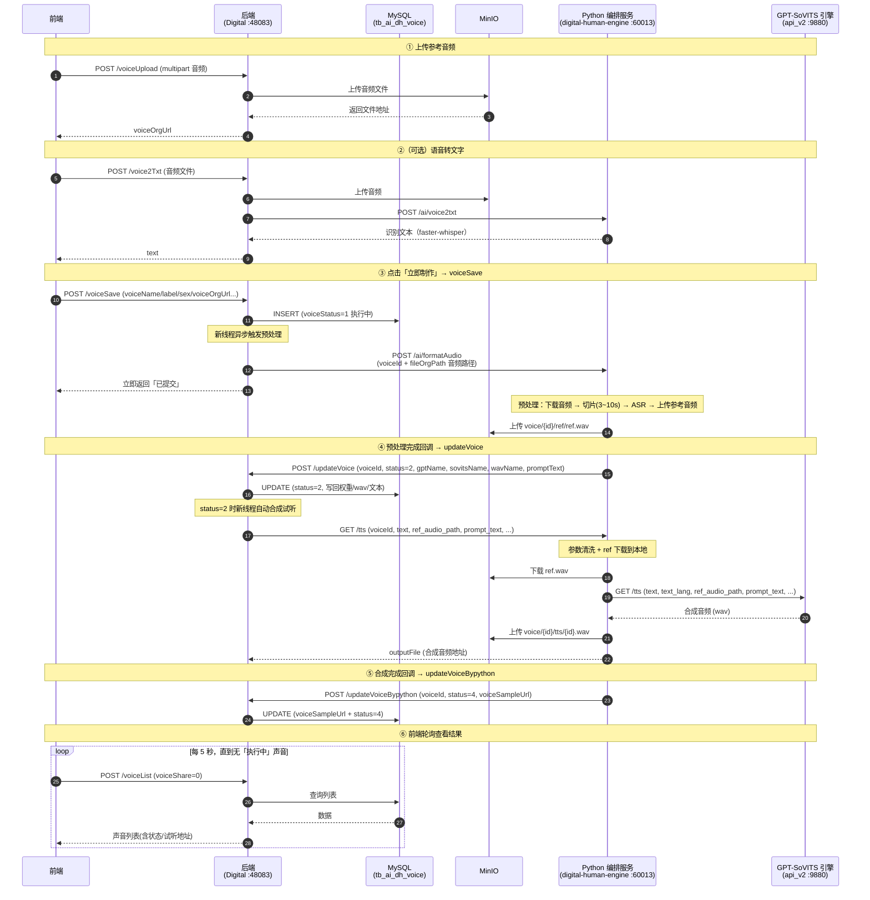
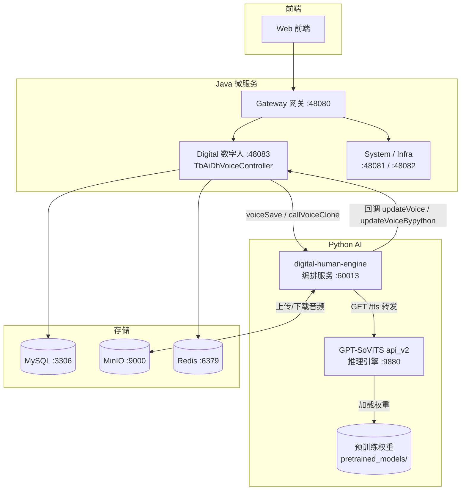

# 声音复刻（Voice Clone）完整时序

> 模块：`yudao-module-digital`
> 核心类：`TbAiDhVoiceController`、`TbAiDhVoiceServiceImpl`
> 数据表：`tb_ai_dh_voice`

## 1. 概述

声音复刻基于 **GPT-SoVITS** 的 **zero-shot（零样本克隆）**：用用户上传的一段音频作为参考样本，通过「参考音频 + prompt_text + 预训练基础权重」直接合成该音色的语音，**无需为每个声音训练独立模型**。

代码里所谓的「训练」（`/ai/formatAudio`）实际是**预处理**——切片 + ASR 转写，产出参考音频和对应文本；真正的语音合成在 `/tts` 由 GPT-SoVITS 零样本推理完成，所有声音共用预训练基础权重。

整条链路是**回调驱动的异步流程**：后端不轮询，由 Python 服务通过 HTTP 回调推进状态。

## 2. 参与者

| 角色 | 说明 |
|---|---|
| 前端 | 声音复刻页面 |
| 后端 | `TbAiDhVoiceController` + `TbAiDhVoiceServiceImpl` |
| MySQL | `tb_ai_dh_voice` 表 |
| MinIO | 音频 / 模型 / 合成结果对象存储 |
| Python 编排服务（`digital-human-engine`，60013） | 接收 Java 请求，做切片/ASR 预处理、转发 GPT-SoVITS、上传 MinIO、回调 Java |
| GPT-SoVITS 推理服务（`api_v2.py`，9880） | 真正的 TTS 合成引擎（zero-shot） |

## 3. Mermaid 时序图



## 4. 各步骤详细说明

### ① 上传参考音频

- 接口：`POST /digital-api/system/voiceManager/voiceUpload`（`TbAiDhVoiceController.java:139`）
- 动作：音频文件上传到 MinIO（`voice/sample/` 目录），返回 `voiceOrgUrl`。

### ②（可选）语音转文字

- 接口：`POST /digital-api/system/voiceManager/voice2Txt`（`TbAiDhVoiceController.java:470`）
- 动作：上传音频 → 调 `/ai/voice2txt` 识别文本，再经过组织字段替换（`getOrgChangeField`）。
- 说明：辅助功能，不在预处理主链路上。

### ③ 「立即制作」= voiceSave

- 接口：`POST /digital-api/system/voiceManager/voiceSave`（controller `:122`，service `:131`）
- 动作：
  1. 插入 `tb_ai_dh_voice` 记录，`voiceStatus=1`（执行中），并写死默认参考文本。
  2. 起新线程，POST `/ai/formatAudio` 触发预处理，传递 `voiceId` + `fileOrgPath`（音频相对路径）等参数；其余 SFTP 路径参数（`downLocalPath` / `slicerOptPath` / `asrOptPath` 等）为历史遗留，Python 侧已不再使用。
- 接口**立即返回**，不等待预处理结果。
- Python 侧 `train_voice` 实际执行：下载音频 → **切片出 3~10 秒语音区** → ASR 切片得 `prompt_text` → 上传切片为 `ref.wav`（存为 `voice_wav_name`）。

### ④ 预处理完成回调 → 自动合成试听

- 接口：`POST /digital-api/system/voiceManager/updateVoice`（controller `:416`，service `:205`）
- 动作：
  1. 写回 `gptName` / `sovitsName` / `wavName` / `promptText`。
  2. 当 `voiceStatus=2` 时，再起新线程调用 `callVoiceClone` 合成试听。

### ⑤ 声音合成（TTS）

- 方法：`callVoiceClone`（controller `:434`，service `:227`）
- 动作：GET `/tts`（`cloneGetPath`），参数如下：

| 参数 | 含义 |
|---|---|
| `voiceId` | `{id}_voice` |
| `prompt_text` | 参考音频的文本 |
| `ref_audio_path` | 参考音频（复刻底子） |
| `sovits_weights_path` / `gpt_weights_path` | 预训练基础权重（所有声音共用，实际由 GPT-SoVITS 的 `tts_infer.yaml` 指定） |
| `text` | 要合成的文本（`voiceReferConent`） |
| `speed_factor` | 语速 |
| `voice_type` | `1` 声音复刻试听 / `2` PPT 批量配音 / `3` 单独 PPT 合成 |
| `bucket_name` | MinIO 桶名 |

返回合成音频的 MinIO 地址（`outputFile`）。

### ⑥ 合成完成回调 → 回写试听地址

- 接口：`POST /digital-api/system/voiceManager/updateVoiceBypython`（controller `:458`，service `:349` `updateVoiceFinall`）
- 动作：`voice_type=1` 分支写回 `voiceSampleUrl` 和最终 `voiceStatus`。

## 5. 状态机

| voiceStatus | 含义 |
|---|---|
| `1` | 预处理中（voiceSave 落库初值） |
| `2` | 预处理完成，待/正在合成试听 |
| `4` | 合成成功（最终可用） |

## 6. 关键点

- **全程异步**：`voiceSave`、`updateVoice` 内均 `new Thread().start()`，接口立即返回，结果靠 Python 回调推进，**不是轮询**。
- **voiceType 用途区分**：
  - `1` 声音复刻试听；
  - `2` PPT 流程批量配音（合成完成后继续触发 `makePptVideoStart` 生成视频）；
  - `3` 单独 PPT 每页配音。
- **回调白名单**：`updateVoice`、`callVoiceClone`、`updateVoiceBypython` 等在 `application-local.yaml` 的 `permit_all_urls` 中，允许 Python 服务匿名调用。
- **前端需轮询**：流程是异步的，前端创建后需轮询 `voiceList` 刷新状态（`1/2` 执行中 → `4` 成功）；`VoiceContainer.vue` 已实现「列表中有执行中声音时每 5 秒轮询一次，全部完成后停止」。

## 7. GPT-SoVITS 部署（本地 CPU / Apple Silicon）

### 7.1 架构

声音复刻由**两个 Python 服务**协作完成，Java 只和编排服务打交道。完整部署拓扑如下：



### 7.2 安装

```bash
cd ~/IdeaProjects/ai-digital
git clone --depth 1 https://github.com/RVC-Boss/GPT-SoVITS.git
cd GPT-SoVITS
python3 -m venv venv
./venv/bin/pip install torch torchaudio
./venv/bin/pip install -r requirements.txt
./venv/bin/pip install torchcodec   # torchaudio 2.11 可能用到（见 7.4）
```

### 7.3 下载预训练权重（V2 底模）

从 `lj1995/GPT-SoVITS`（国内用镜像 `https://hf-mirror.com`）下载到 `GPT_SoVITS/pretrained_models/`：

| 文件 | 大小 | 用途 |
|---|---|---|
| `chinese-hubert-base/` | ~180M | 参考音频特征提取（HuBERT） |
| `chinese-roberta-wwm-ext-large/` | ~620M | 文本特征（BERT） |
| `gsv-v2final-pretrained/s1bert25hz-5kh-longer-epoch=12-step=369668.ckpt` | ~150M | GPT 底模（文本 → 语义 token） |
| `gsv-v2final-pretrained/s2G2333k.pth` | ~100M | SoVITS 底模（语义 token → 波形） |

额外模型（非 HF）：

- `pretrained_models/fast_langdetect/lid.176.bin`（~128M，语言检测），从 `https://dl.fbaipublicfiles.com/fasttext/supervised-models/lid.176.bin` 下载。

### 7.4 Apple Silicon 上必须的三处修改

1. **`GPT_SoVITS/configs/tts_infer.yaml`** 的 `custom` 段：
   ```yaml
   device: cpu        # 原 cuda
   is_half: false     # 原 true
   ```
2. **`GPT_SoVITS/TTS_infer_pack/TTS.py:772`**：torchaudio 2.11 的 `torchaudio.load` 走 torchcodec 后端（需 FFmpeg 共享库，Mac 上易失败），改为 librosa：
   ```python
   raw_audio_np, raw_sr = librosa.load(ref_audio_path, sr=None)
   raw_audio = torch.from_numpy(raw_audio_np).unsqueeze(0)
   ```
3. **下载 fast_langdetect 模型**（见 7.3），否则推理报 `Cache directory not found`。

### 7.5 启动顺序

```bash
# 1. GPT-SoVITS 推理服务（9880）
cd ~/IdeaProjects/ai-digital/GPT-SoVITS
nohup ./venv/bin/python api_v2.py -a 127.0.0.1 -p 9880 \
  -c GPT_SoVITS/configs/tts_infer.yaml > /tmp/gpt_sovits.log 2>&1 &

# 2. 编排服务（60013）
cd ~/IdeaProjects/ai-digital/digital-human-engine
nohup ./.venv/bin/uvicorn app:app --host 127.0.0.1 --port 60013 \
  > /tmp/uvicorn.log 2>&1 &
```

### 7.6 关键环境变量（`digital-human-engine/config.py`）

| 变量 | 默认值 | 说明 |
|---|---|---|
| `GPT_SOVITS_API` | `http://127.0.0.1:9880` | GPT-SoVITS `api_v2` 地址 |
| `GPT_SOVITS_TIMEOUT` | `120` | 推理超时（秒），CPU 慢需够大 |
| `GPT_SOVITS_GPT_WEIGHTS` / `GPT_SOVITS_SOVITS_WEIGHTS` | 占位路径 | 仅写入 DB 记录；推理实际权重由 `tts_infer.yaml` 决定 |

### 7.7 参数映射（Java → api_v2）

Java `callVoiceClone` 传参名与 GPT-SoVITS `api_v2.py` 基本一致，但编排服务 `voice.tts()` 会做清洗：

| Java 传参 | api_v2 期望 | 处理 |
|---|---|---|
| `text` / `text_lang` / `prompt_text` / `prompt_lang` / `speed_factor` | 同名 | 原样透传 |
| `text_split_method` / `batch_size` / `media_type` | 同名 | 原样透传 |
| `ref_audio_path`（MinIO 键） | 本机文件路径 | 编排服务下载到本地临时文件再传 |
| `sovits_weights_path` / `gpt_weights_path` | 不需要 | 丢弃（权重走 `tts_infer.yaml`） |
| `streaming_mode`（字符串 `"false"`） | bool/int | 丢弃（避免字符串被当 truthy） |
| `voiceId` / `voice_type` / `bucket_name` | 不需要 | Java 侧专用，编排服务已 pop |

### 7.8 性能

- **CPU（Apple Silicon）**：一句短话约 **30~40 秒**，仅适合本地联调。
- **生产需 GPU**：同句约 1~2 秒。

> 附：本次验证在 `darwin arm64 / 16GB 内存` 环境跑通，输出为 32kHz WAV。

## 8. 故障排查 FAQ

### 8.1 合成结果总是女声

**现象**：上传男声，合成出来仍是女声（`zh-CN-XiaoxiaoNeural`）。

**原因**：编排服务（`digital-human-engine`）之前是 edge-tts 桩，`voice.tts()` 没真正调用 GPT-SoVITS，固定用女声音色。

**排查**：看 `/tmp/uvicorn.log` 是否反复出现 `GPT-SoVITS 推理失败，回退 edge-tts`。

**解决**：部署 GPT-SoVITS 并让 `GPT_SOVITS_API` 指向它（见 §7），合成不再回退，音色由参考音频决定。

### 8.2 GPT-SoVITS 报 TorchCodec / libtorchcodec 错误

**现象**：`/tts` 返回 400，报 `TorchCodec is required for load_with_torchcodec` 或 `Could not load libtorchcodec`。

**原因**：torchaudio 2.11 的 `torchaudio.load` 走 torchcodec 后端，Mac 上 FFmpeg 共享库版本不匹配。

**解决**：`GPT_SoVITS/TTS_infer_pack/TTS.py:772` 改用 `librosa.load`（见 §7.4）。注意：只装 `torchcodec` 不一定够（它仍依赖 FFmpeg），直接绕开最省事。

### 8.3 GPT-SoVITS 报 fast_langdetect 目录不存在

**现象**：`fast-langdetect: Cache directory not found: .../pretrained_models/fast_langdetect`。

**原因**：语言检测模型 `lid.176.bin` 未下载。

**解决**：下载到 `GPT_SoVITS/pretrained_models/fast_langdetect/lid.176.bin`（~128M，见 §7.3）。

### 8.4 GPT-SoVITS 启动报 CUDA / 精度错误

**现象**：启动或推理时报 CUDA 相关错误。

**原因**：`tts_infer.yaml` 的 `custom` 段默认 `device: cuda`、`is_half: true`，Mac 无 CUDA、CPU 不支持 fp16。

**解决**：改 `device: cpu`、`is_half: false`（见 §7.4）。

### 8.5 连续两次克隆，第二次 URL 错乱

**现象**：第二次声音复刻的 `/tts` URL 出现双 `?`、参数重复堆积。

**原因**：`TbAiDhVoiceServiceImpl.callVoiceClone` 用 `cloneGetPath += ...` 原地修改了 `@Value` 注入的单例字段。

**解决**：改用局部变量拼接 URL（已修复）。

### 8.6 新建声音后列表查不到

**现象**：`voiceList` 按 `voiceShare="0"` 查不到刚复刻的声音。

**原因**：`voiceSave` 没给 `voice_share` 赋值（默认 NULL）。

**解决**：`voiceSave` 里 `setVoiceShare("0")`（已修复）。

### 8.7 /tts 返回 400

**现象**：直接调 GPT-SoVITS `/tts` 返回 400。

**常见原因**：
- `streaming_mode` 传了字符串 `"false"`（api_v2 只认 bool/int，字符串被当 truthy）。
- 参数名不匹配（如 `sovits_weights_path` vs `sovits_path`）。

**解决**：编排服务 `voice.tts()` 已做参数清洗——丢弃 `streaming_mode`、`sovits_weights_path`、`gpt_weights_path` 等，权重由 `tts_infer.yaml` 指定（见 §7.7）。

### 8.8 CPU 推理太慢

**现象**：一句短话合成要 30~40 秒。

**原因**：GPT-SoVITS 零样本推理（semantic token 预测 + 声学合成）在 CPU 上重计算。

**解决**：生产用 GPU（同句约 1~2 秒）；本地联调可缩短合成文本长度。

### 8.9 前端显示「执行中」但不更新

**现象**：点「立即制作」后，前端卡片一直显示「执行中」，即使后台已完成（`voice_status=4`）。

**原因**：前端 `VoiceContainer.vue` 原本只在 `onMounted` 加载一次列表，没有轮询。

**解决**：`VoiceContainer.vue` 增加轮询——列表中存在 `1/2`（执行中）状态的声音时，每 5 秒刷新一次；全部完成后自动停止。
