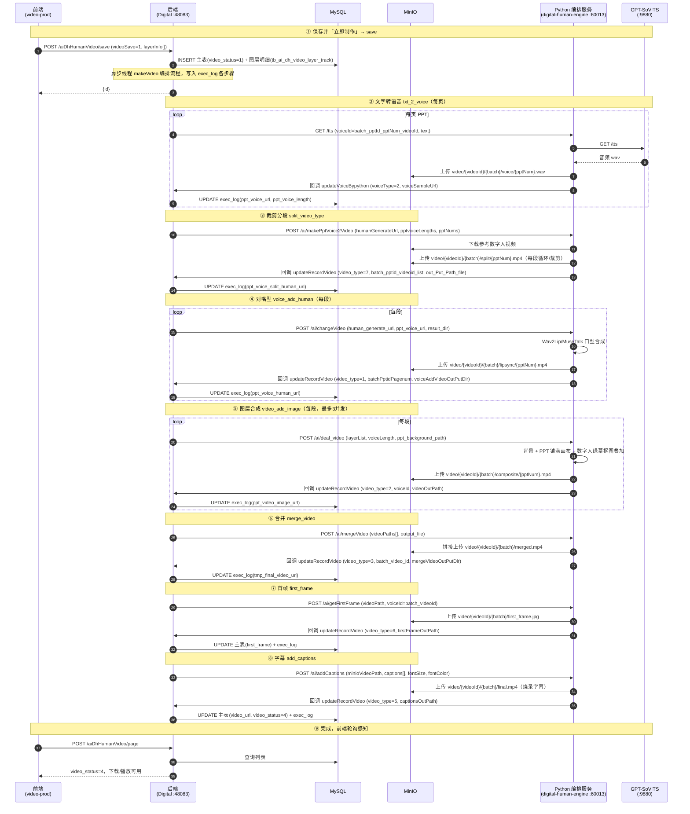
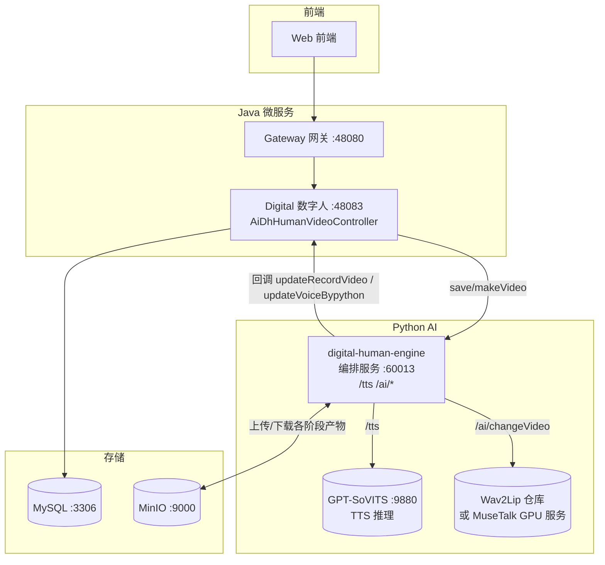

# 视频创作（Digital Human Video）完整时序

> 模块：`yudao-module-digital`
> 核心类：`AiDhHumanVideoController`、`AiDhHumanVideoServiceImpl`、`AiDhHumanVideoAdaptor`
> 数据表：`tb_ai_dh_video`（视频主表）、`tb_ai_dh_video_layer_track`（图层明细）、`tb_ai_dh_video_exec_log`（流程执行日志）、`tb_ai_dh_copywrite`（文案主表）、`tb_ai_dh_copywrite_ppt_record_detail`（PPT 每页明细）、`tb_ai_dh_human`（数字人）、`tb_ai_dh_voice`（声音）
> 对象存储：MinIO（`aidigital` bucket）

## 1. 概述

视频创作 = **数字人视频制作**：用户在前端画布上选好「文案（PPT）+ 数字人形象 + 声音」，点「立即制作」，系统把这些素材编排成一条 **PPT 播报视频**（数字人在 PPT 画面上照着文案逐页说话）。

整条链路是**回调驱动的异步流水线**，由后端把制作任务拆成 7 个串行步骤写入执行日志，逐步调用 Python 服务处理、再靠 Python 回调推进下一步：

1. **文字转语音**（txt_2_voice）：每页 PPT 文案 → 语音（GPT-SoVITS）。
2. **裁剪分段**（split_video_type）：参考数字人视频按每段语音时长循环/裁剪。
3. **对嘴型**（voice_add_human）：数字人视频 + 语音 → 口型合成（Wav2Lip / MuseTalk）。
4. **图层合成**（video_add_image）：背景图 + PPT 图片 + 数字人抠图 叠加成一段视频。
5. **合并**（merge_video）：所有分段拼接成完整成片。
6. **提取首帧**（first_frame）：生成封面图。
7. **加字幕**（add_captions）：按页时间轴烧录底部字幕（ASS）。

制作进度由 `tb_ai_dh_video_exec_log`（执行日志）驱动，`video_status` 反映整体状态。

## 2. 参与者

| 角色 | 说明 |
|---|---|
| 前端 | 视频制作（`video-prod.vue`）+ 视频列表（`DigitalVideo.vue` + `CardVideo.vue`） |
| 后端 | `AiDhHumanVideoController` + `AiDhHumanVideoServiceImpl` + `AiDhHumanVideoAdaptor` |
| MySQL | `tb_ai_dh_video` / `tb_ai_dh_video_layer_track` / `tb_ai_dh_video_exec_log` 及关联的文案/数字人/声音表 |
| MinIO | 各阶段产物对象存储 |
| Python 编排服务（`digital-human-engine`，60013） | `/tts`、`/ai/makePptVoice2Video`、`/ai/changeVideo`、`/ai/deal_video`、`/ai/mergeVideo`、`/ai/getFirstFrame`、`/ai/addCaptions` |
| GPT-SoVITS（9880） | 语音合成（TTS）推理 |
| Wav2Lip / MuseTalk | 数字人口型合成（`LIPSYNC_MODEL` 控制，见 §7） |

## 3. Mermaid 时序图

## 4. 各步骤详细说明

### ① 保存并「立即制作」= save

- 接口：`POST /digital-api/system/aiDhHumanVideo/save`（controller `:60`，service `:177`）
- 入参：`AiDhHumanVideoSaveVO`（`copywriteId`、`humanId`、`voiceId`、`videoSave`、`layerInfo[]`、分辨率/比例等）
- 动作：
  1. 无 `id` → 存草稿（`SequenceUtils.getSeq()` 生成 id，`video_status=1`）；有 `id` → 正式保存（`updateById`）。
  2. 落图层明细 `tb_ai_dh_video_layer_track`（`scene_id=id`，删除旧明细后重插）。
  3. `videoSave=1` 且保存成功 → 起一个线程：先 `updateMakeVideoStatus(id, 2)`，再 `makeVideo()`。
- 接口**立即返回** `{id}`，制作在后台线程进行。

### ② 编排流程 = makeVideo / makePptVideoStart

- `makeVideo`（service `:251`）：把 7 步任务写入 `tb_ai_dh_video_exec_log`（每页 PPT 一条 txt_2_voice / voice_add_human / video_add_image，各一条 split / merge / first_frame / add_captions），同一 `batch_num`（时间戳）+ `exec_order` 顺序，然后 `makePptVideoStart(videoId, batch, null)`。
- `makePptVideoStart`（service `:386`）：**流程调度核心**。查 `getvideoExecLogDetail`（`exec_status=''` 的最小 `exec_order` 行）拿到「下一步」，按 `model_type` 分发到对应处理方法；全部执行完 → `video_status=4`。
- 每一步处理完 **不自己推进**，而是等 Python 回调后再次触发 `makePptVideoStart`。

### ③ 文字转语音 txt_2_voice

- Java：`makePptTxt2Voice`（service `:483`）→ `TbAiDhVoiceServiceImpl.callVoiceClone`（`voiceType=2`）
- Python：`app.py` 的 `tts`（`:85`）→ `services/voice.py:tts()` 转发到 GPT-SoVITS（`GPT_SOVITS_API :9880`）
- 动作：每页 PPT 文案（`ppt_image_words`）合成语音，上传 `video/{videoId}/{batch}/voice/{pptNum}.wav`。
- 回调：`POST /voiceManager/updateVoiceBypython`（`voiceType=2`）→ 更新 exec_log 的 `ppt_voice_url`、`ppt_voice_length`，再 `makePptVideoStart` 下一步。
- 关键：`ppt_voice_length` 是后续裁剪/合并的时间轴依据。回调缺时长时 Java 从 wav 头解析（`TbAiDhVoiceServiceImpl.resolveVoiceLength`）。

### ④ 裁剪分段 split_video_type

- Java：`splitVideoData`（service `:545`）
- Python：`app.py` 的 `make_ppt_voice2video`（`:390`）→ `services/video.py:loop_video`（`:218`）
- 动作：优先用数字人的**抠像绿幕视频**（`human_generate_url`，无则用原片 `human_org_url`），按每段语音时长 `-stream_loop -1 -t <时长>` 循环/裁剪，上传 `video/{videoId}/{batch}/split/{pptNum}.mp4`。
- 回调：`updateRecordVideo`（`video_type=7`）携带 `batch_pptid_videoid_list`（标识符，格式 `batch_pptId_videoId_pptNum`）+ `out_Put_Path_file`（输出路径），逐段写 exec_log 的 `ppt_voice_split_human_url`，再推进。

### ⑤ 对嘴型 voice_add_human

- Java：`voiceAddHuman`（service `:620`）
- Python：`app.py` 的 `change_video`（`:323`）→ `_lipsync_change_video()` 按 `LIPSYNC_MODEL` 调度 `wav2lip.change_video()` / `musetalk.change_video()`
- 动作：数字人分段视频 + 语音 → 口型合成，上传 `video/{videoId}/{batch}/lipsync/{pptNum}.mp4`。
- 回调：`updateRecordVideo`（`video_type=1`）→ 写 `ppt_voice_human_url`。
- 说明：`LIPSYNC_MODEL=passthrough` 时不做真实口型，仅把语音音轨 mux 到视频上（快速联调用）；`wav2lip`（CPU，慢）/ `musetalk`（GPU）为真实口型。

### ⑥ 图层合成 video_add_image

- Java：`videoAddImageLayerTrack`（service `:732`）
- Python：`app.py` 的 `deal_video`（`:365`）→ `services/video.py:composite_video`（`:233`）
- 动作：把 `layerList` 各图层（数字人视频 / PPT 图片 / 前景装饰 / 动态背景视频）按 `layerOrder` 依次叠加：
  - 背景图铺底（`ppt_background_path`，即 `defaultImageUrl`）；
  - PPT 图层（type=3）**强制缩放到铺满画布**；
  - 数字人图层（type=1）先 `colorkey=0x00FF00` 去绿幕抠图再叠加；
  - 音轨取数字人视频（`-map N:a`）。
  - 输出 `video/{videoId}/{batch}/composite/{pptNum}.mp4`。
- 回调：`updateRecordVideo`（`video_type=2`）→ 写 `ppt_video_image_url`。
- 并发：`makePptVideoStart` 里 `video_add_image` 最多 3 段并发（`TOTAL_CAN_RUN_NUM=3`，`exec_status='3'` 表示执行中）。

### ⑦ 合并 merge_video

- Java：`videoMerge`（service `:886`）
- Python：`app.py` 的 `merge_video`（`:215`）→ `services/video.py:merge_video`（concat 拼接）
- 动作：把所有分段合成视频按顺序 concat，输出 `video/{videoId}/{batch}/merged.mp4`。
- 回调：`updateRecordVideo`（`video_type=3`）→ 写 `tmp_final_video_url`。

### ⑧ 首帧 first_frame

- Java：`makeVideoFrame`（service `:1114`）
- Python：`app.py` 的 `get_first_frame`（`:292`）→ `services/video.py:get_first_frame`
- 动作：从合并成片抽首帧，输出 `video/{videoId}/{batch}/first_frame.jpg`。
- 回调：`updateRecordVideo`（`video_type=6`）→ 写主表 `first_frame` + exec_log。

### ⑨ 字幕 add_captions

- Java：`videoAddCaptions`（service `:1025`）
- Python：`app.py` 的 `add_captions`（`:264`）→ `services/video.py:add_captions`（`:91`）
- 动作：Java 按页取 `ppt_image_words` + 每段 `ppt_voice_length` 构建字幕时间轴 `captions=[{text,start,end}]`，Python 生成 **ASS**（`PlayRes 1920x1080`、`Alignment=2` 底部居中、`WrapStyle=0` 自动换行）用 libass 烧录，输出 `video/{videoId}/{batch}/final.mp4`。
- 回调：`updateRecordVideo`（`video_type=5`）→ 写主表 `video_url=final.mp4`，全部步骤完成 → `video_status=4`。

## 5. 状态机

| video_status | 含义 |
|---|---|
| `1` | 已保存未制作（save 落库初值） |
| `2` | 执行中（makeVideo 落库，等待各步回调） |
| `3` | 执行失败（任一步回调 status 失败） |
| `4` | 执行成功（全部步骤完成，最终可用） |

`tb_ai_dh_video_exec_log.exec_status`：

| exec_status | 含义 |
|---|---|
| `''`（空） | 未执行（下一步候选） |
| `1` | 成功 |
| `2` | 失败 |
| `3` | 执行中（仅 `video_add_image` 并发控制用） |

## 6. 关键点

- **全程回调异步**：`makePptVideoStart` 处理完一步即返回，靠 Python 回调 `updateRecordVideo` / `updateVoiceBypython` 推进下一步，**不轮询**。前端列表页（`DigitalVideo.vue`）有轮询——列表存在 `video_status=2` 时每 5 秒刷新，完成/失败弹提示。
- **执行日志驱动**：7 步任务全部先写入 `tb_ai_dh_video_exec_log`，每步用 `model_type` 区分，`batch_num`（时间戳）标识一次制作批次；同一视频可反复「立即制作」，每次新 batch。
- **回调标识符与文件路径分离**：Python 回调里「标识符」（`batch_pptid_videoid_list`、`batchPptidPagenum`、`batch_video_id`，格式 `batch_pptId_videoId_pptNum` 等）与「输出路径」分开传，Java 按标识符定位 exec_log 行、按路径落 `*_url` 字段。改 MinIO 目录结构不影响标识符契约。
- **MinIO 对象键结构**（本视频一条 `video/{videoId}/{batch}/` 下）：
  - 语音：`video/{videoId}/{batch}/voice/{pptNum}.wav`
  - 裁剪：`video/{videoId}/{batch}/split/{pptNum}.mp4`
  - 对嘴型：`video/{videoId}/{batch}/lipsync/{pptNum}.mp4`
  - 图层合成：`video/{videoId}/{batch}/composite/{pptNum}.mp4`
  - 合并：`video/{videoId}/{batch}/merged.mp4`
  - 首帧：`video/{videoId}/{batch}/first_frame.jpg`
  - 成片：`video/{videoId}/{batch}/final.mp4`
- **对嘴型模型**：`config.py` 的 `LIPSYNC_MODEL`（`wav2lip` CPU / `musetalk` GPU / `passthrough` 快速占位）。
- **数字人抠图**：裁剪用绿幕抠像视频（`avatar/{humanId}/matting/`），图层合成时 `colorkey` 去绿幕。
- **字幕用 ASS**：`add_captions` 生成 ASS + libass 烧录，`PlayRes 1920x1080` + `Alignment=2` 底部居中 + `WrapStyle=0` 自动换行，避免长文案堆成一行。
- **删除连带清理**：`deleteAiDhHumanVideo`（service `:1303`）删主表 + 图层明细 + 执行日志 + 全部 MinIO 中间产物（`deleteVideoMinioFiles` 收集各 `*_url` 字段去重后 `minioDelete`）。

## 7. 部署架构

- 编排服务 `digital-human-engine` 与「声音复刻/形象复刻/文案创作」共用，端口 60013。
- 语音合成走 GPT-SoVITS（9880），Python `/tts` 透传参数、失败回退 edge-tts。
- 口型合成见 `形象复刻完整时序.md §7.2`（Wav2Lip CPU 部署 / MuseTalk GPU）。
- 视频处理的 ffmpeg 操作（循环、合成、合并、首帧、字幕）都在 `services/video.py` 内用 subprocess 调 ffmpeg。

## 8. 故障排查 FAQ

### 8.1 视频卡在「执行中」，某一 `*_url` 字段是 "null" 或空

**现象**：`video_status=2` 一直不变，某一步的 `ppt_voice_length` / `ppt_voice_url` 等是字符串 `"null"`。

**原因**：早期 Python 声音回调没带 `length`，Java 把 `hashMap.get("length")+""` 写成字面 `"null"`，下一步 `Integer.parseInt("null")` 崩掉。

**解决**：`TbAiDhVoiceServiceImpl.resolveVoiceLength` 已在回调缺时长时从 MinIO 下载 wav 解析时长（已修复）。

### 8.2 卡在「图层合成」那步，`video_add_image` 永远 `exec_status='3'`

**现象**：合并步骤一直等不到 `video_add_image` 完成。

**原因**：`videoAddImageLayerTrack` 曾把 `exec_status='3'`（执行中）设在**同步调用 Python 之后**，回调先置 `1` 又被覆盖回 `3`，合并步骤判断「还有执行中」而永不推进（竞态）。

**解决**：改为**先**置 `3` 再调 Python（已修复），回调 `1` 正常覆盖。

### 8.3 字幕那步 `HttpTimeoutException: request timed out`

**现象**：Java 日志 `AbilityShareClient.execute` 抛 30s 超时，但视频最终仍能完成。

**原因**：字幕要对整段视频重编码烧字幕（约 1~2 分钟），超过 `doPost` 的 30s 超时；但流程是回调推进，超时只是日志噪音，不影响结果。

**解决**：视频处理类接口统一改用 `doPostPPt`（300s 超时）已修复。

### 8.4 生成的视频口型对不上

**现象**：数字人嘴不动，和音频对不上。

**原因**：`LIPSYNC_MODEL=passthrough` 只把语音贴到视频上，没做口型合成。

**解决**：切 `LIPSYNC_MODEL=wav2lip`（CPU，慢，见 `形象复刻完整时序.md §7.2`）或 `LIPSYNC_MODEL=musetalk`（GPU）。

### 8.5 数字人是整块矩形（带背景）

**现象**：视频里数字人是一整块带背景的画面，不是抠图。

**原因**：裁剪用了原始视频（`human_org_url`）而非抠像绿幕视频，或图层合成没做 colorkey。

**解决**：`splitVideoData` 已优先用 `human_generate_url`（抠像绿幕视频，无则退回原片），`composite_video` 对数字人图层 `colorkey=0x00FF00` 去绿幕（已修复）。前提是形象创建时选了「去除背景」（`humanBg=1`）生成了绿幕视频。

### 8.6 PPT 图片没铺满屏幕

**现象**：视频里 PPT 幻灯片缩在左上角，没铺满 1920x1080。

**原因**：图层合成曾按图层自带 `boxw/boxh`（如 1536×864）缩放，没铺满画布。

**解决**：`composite_video` 对 PPT 图层（type=3）强制缩放到画布尺寸（已修复）。

### 8.7 字幕堆成一行 / 不换行

**现象**：字幕是一整条长文本堆在一行。

**原因**：早期用 SRT + 默认样式，长文案不换行。

**解决**：改用 ASS（`PlayRes 1920x1080` + `WrapStyle=0` 自动换行 + `Alignment=2` 底部居中）已修复。

### 8.8 删除视频后 MinIO 文件残留

**现象**：删了视频记录，MinIO 里的成片/中间产物还在。

**原因**：早期删除只 `deleteById` 主表。

**解决**：`deleteAiDhHumanVideo` 已连带删图层明细、执行日志，并收集各 `*_url` 字段去重后 `minioDelete`（已修复）。
